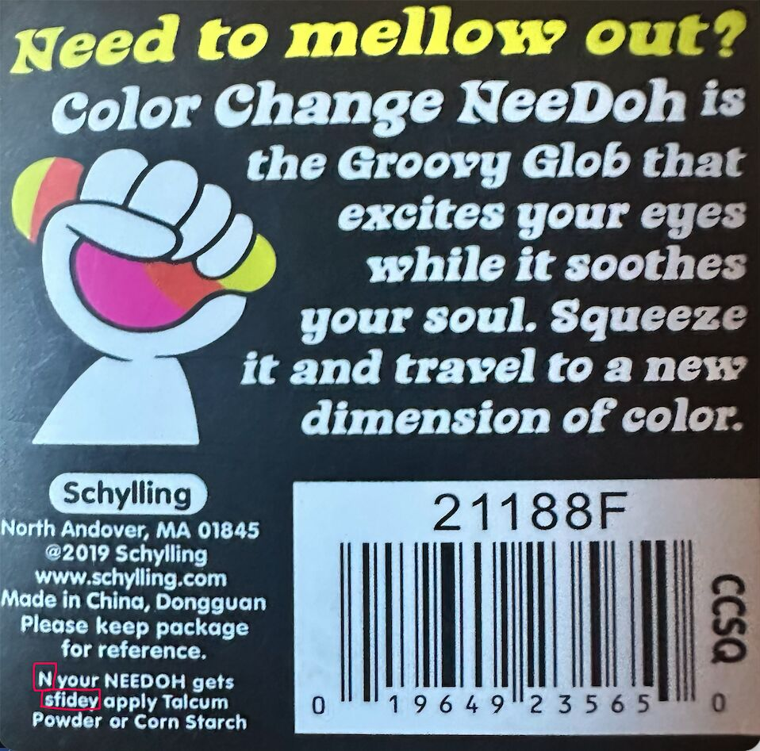

Nee-DONT!
Scammers. All I wanted was slurpees for the kids from the local gas station… Apparently there is a national NeeDoh craze? My oldest recognized these were sold out and that we had an opportunity to up-sell when we stumbled across a stack at the local gas station. Needless to say, we stocked up.

If only we had paid attention to the fine print… great packaging clone but in hindsight, they clearly used generative ai to make the image and it hallucinated while recreating the text.

“N your NeeDoh gets sfidey apply talcum powder”
You mean if it gets sticky?

Lessons learned:
*If it looks and sounds too good to be true, it probably is.

*Greed gives you blinders.

*AI just made the blinders cheaper to manufacture.

Mental notes:
*sti hallucinates with sfi

Insult to injury-- they weren't even color changing... LOL
#GenerativeAI #AIHallucination #Counterfeit #ConsumerAwareness #TechHumor #FOMO #Parenting #NeeDOH

1
​
​

