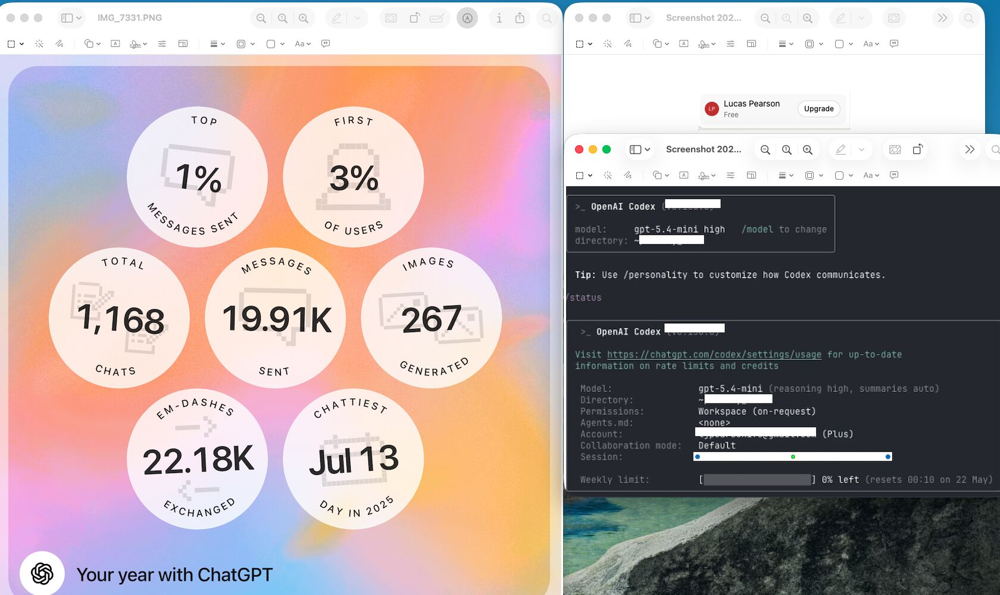

OpenAI
Looks like you're hemorrhaging tokens broskies...
It's been awhile since i've paid for that subscription level...Long enough this smells like some type of entitlement mismatch and state error.
You might be gushing...seal the wound and let me back at the slot machine--please and thank you-- and by that I mean audit/rectify everyone but me.
As Ace would say..."How long has this been going on?"

#TokenEconomy #AlwaysBeBuilding #AI

​
​
​

