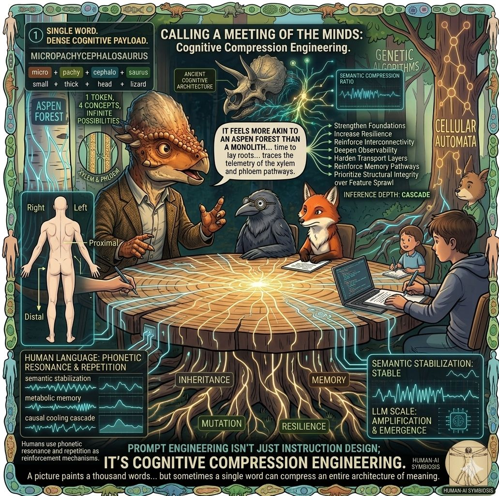

Calling a meeting of the minds.

“A picture paints a thousand words” — but I’m starting to think scientific metaphor may paint the most semantically compressed picture possible.

Almost like sensor fusion… but for language.
Language fusion.

I had this realization while thinking about the word:

“Micropachycephalosaurus.”

One word.
Yet semantically:
micro + pachy + cephalo + saurus

small + thick + head + lizard.

I recently told my coding agent swarm:

“It’s time to lay roots. Harden. Reinforce the mycelial network and trace the telemetry of the xylem and phloem pathways.”

My intuition is that the models were inferring far more than:
“improve the architecture.”

The metaphor implicitly carried:
• resilience
• interconnected systems
• memory pathways
• transport layers
• observability
• structural hardening
• controlled growth

Almost like the phrase acts as a cognitive macro:
a compressed executable topology.

What’s especially interesting is that software engineering already speaks in biological metaphor:
neural networks
genetic algorithms
inheritance
mutation
viral propagation
ecosystem dynamics

So when biologically rooted metaphor is layered onto systems design — then consumed by coding agents — it starts to feel like inception…
abstractions built from abstractions sharing the same conceptual DNA.

Even alliteration feels computationally useful:
“semantic stabilization”
“metabolic memory”
“causal cooling cascade”

Humans already use phonetic resonance and repetition as reinforcement mechanisms.

So what happens when LLMs consume those same symbolic patterns at scale?

Maybe the next frontier isn’t longer prompts— maybe it’s higher-density symbolic compression.

#ArtificialIntelligence #PromptEngineering #GenerativeAI #ComputationalLinguistics #SemanticCompression

2
​
​

