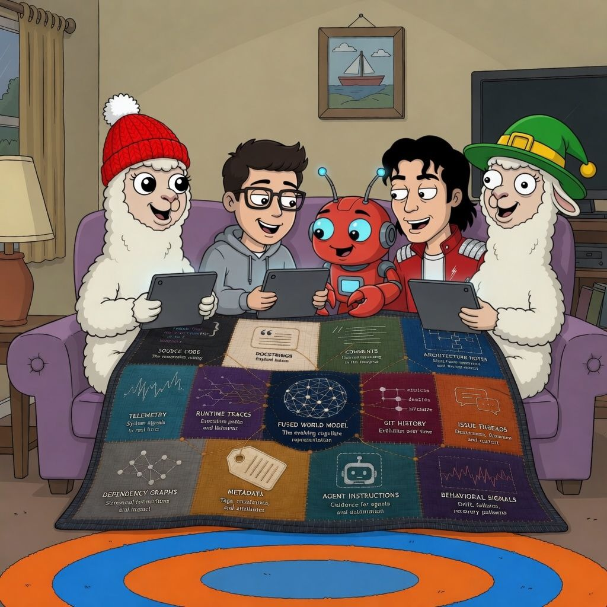

Code Fusion
A codebase is not something you read. It’s something you model.
Not because code is insufficient — but because it is only one projection of a much larger system state.
A codebase is a multi-sensor environment.
It emits overlapping signals:
• Source Code
• Docstrings
• Comments
• Architecture Notes
• Telemetry
• Runtime Traces
• Git History
• Issue Threads
• Dependency Graphs
• Metadata
• Agent Instructions
Each patch observes the same system from a different angle.
Individually: incomplete.
Together: a latent world model of the system itself.
This is where it gets interesting.
In modern systems, “strings” are no longer just text. They become structured carriers of cognition:
Code Strings → executable reality
Doc Strings → explicit intent
Agent Strings → machine-facing coordination
Meta Strings → scoped rules & constraints
Behavioral Strings → runtime truth (traces, drift, failures, recovery)
When fused, they stop behaving like documentation.
They behave like an evolving cognitive system.
The question is no longer:
“What does this code do?”
It becomes:
• What shaped it?
• How did it evolve?
• Where is it drifting?
• What does it protect?
• How does change propagate?

This is where multi-agent software engineering becomes inevitable.
Not just code generation — but continuous world-model maintenance of living systems.
Code Fusion
A JEPA-like latent representation of software itself.
#CodeFusion #WorldModel #SoftwareEngineering #MultiAgent #AI #AlwaysBeBuilding

​
​
​

