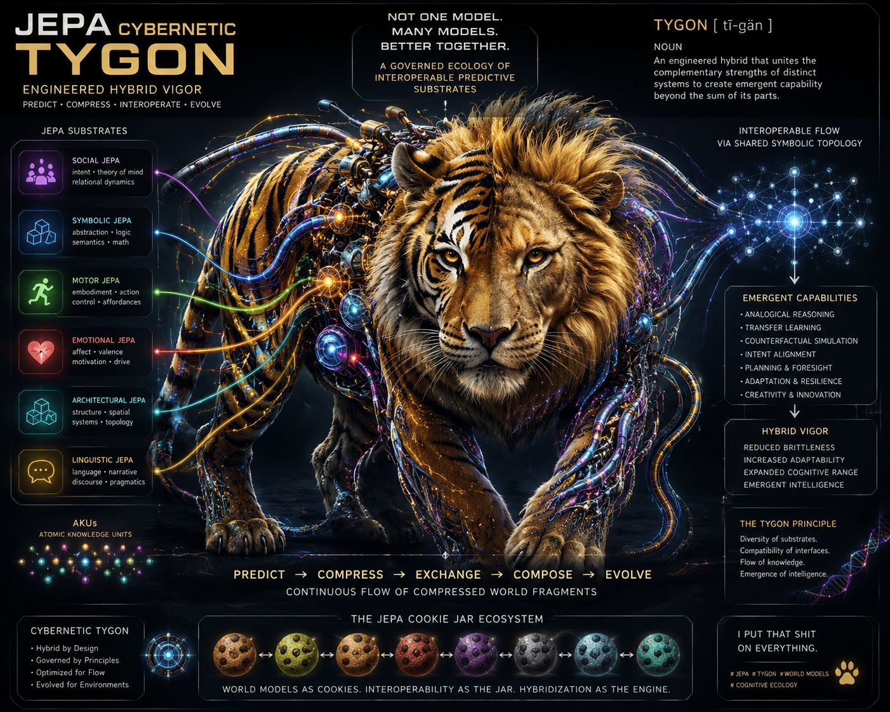

Napoleon Dynamite introduced a generation to the Liger.

But let’s be  honest:

The Tygon is the superior hybrid.

That idea of hybrid vigor may also describe the next major shift in AI architecture.

I keep coming back to the idea that JEPA may be far bigger than vision models.

What if JEPA is closer to a universal cognitive pattern or even a unit of cognitive measurement itself.

Sensor fusion as JEPA.
Language fusion as JEPA.
Code fusion as JEPA.

(code fusion:

• code
• docstrings
• agent strings
• meta strings
• telemetry
• behavioral traces
• semantic trajectories)

All compressing into predictive environmental models.

Lately I’ve been thinking about this through the lens of AKUs:

Atomic Knowledge Units.

Tiny semantic particles composed of:

• observations
• behaviors
• memories
• relationships
• decisions
• context
• motion through environments

Not just stored information —
but relational environmental understanding.

Behavioral cookies.
Cognitive cookies.

And then the thought that really broke my brain:

A JEPA Cookie Jar.

Not one giant monolithic intelligence —
but a governed ecology of interoperable predictive substrates.

A bag of interacting world models.

Different latent structures of reality modeled simultaneously:

• social JEPA
• symbolic JEPA
• motor JEPA
• emotional JEPA
• architectural JEPA
• linguistic JEPA

Each operating across different abstractions, compressions, and prediction horizons.

AKUs combining into predictive clusters.
Cookies combining into larger cookies.
World models recursively composing into higher-order world models.

Hybrid vigor for cognition.

A bag of world models.

A JEPA Cookie Jar.

I put that shit on everything.

#ArtificialIntelligence #JEPA #WorldModels #MachineLearning #NeurosymbolicAI #AgenticAI #CognitiveArchitecture #GenerativeAI #SystemsThinking #MultiAgentSystems #EmbodiedAI #SemanticCompression #AIResearch #PredictiveModels

​
​
​

