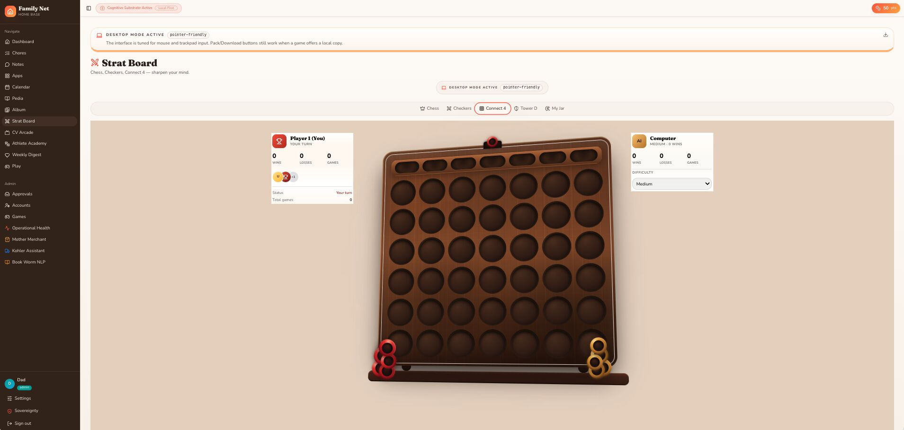

There’s an under-discussed competitive advantage that begins long before school, careers, or even language:
Siblings.
Not as individuals — but as a stacked, compounding training system.
The oldest gets the raw, unoptimized parenting run. By the youngest, the system has been refined: better heuristics, corrected mistakes, and older siblings acting as tutors, rivals, coaches, and sparring partners.
What emerges is cascading reinforcement — a multi-agent environment where capability compounds across children. Each new sibling inherits a denser library of what I call family atomic knowledge units: compressed fragments of behavior, strategy, correction, and social calibration.
Siblings provide what structured learning rarely can:
Repetition without instruction
Competition without structure
Teaching without intent
Rivalry that forces real calibration
But every system eventually saturates.
Once you’ve had as many children as you’re going to have — what then?
You don’t stop the system.
You extend it.
This is where ghost trainers enter.
Think back to racing games: the ghost racer wasn’t another player. It was a replay of your best lap — a persistent, optimized version of you moving through the environment. A benchmark of your own peak performance.
You weren’t racing against others.
You were racing against your own best trajectory.
Ghost trainers work the same way.
You externalize and replay the strongest parts of the family system — especially when you or your siblings aren’t physically available:
Replayed sibling decision traces and optimal gameplay modeling
“What would my older sibling do?” mental models
Adversarial coaching personas formed from real family friction
Idealized behavioral trajectories over time
And this isn’t just theoretical.
In Family Net’s Strat Board (our Connect 4 module), we’ve implemented this idea in practice. The ghost trainer projects forward move sequences: “If you play here → opponent responds here → this branch collapses → this position emerges.”
It’s not just reacting in real time.
It’s running ghost trajectories of the game state — training forward stepwise thinking through simulated decision space.
So the system evolves:
From siblings → to ghosts
From interaction → to replay
From upbringing → to continuous calibration layer
Siblings are the biological training substrate.
Ghost trainers are the computational replay layer.
So the real question ...
Are you willing to keep racing your own best possible version — and become the family data scientist of your own cognitive stack?

​
​
​

