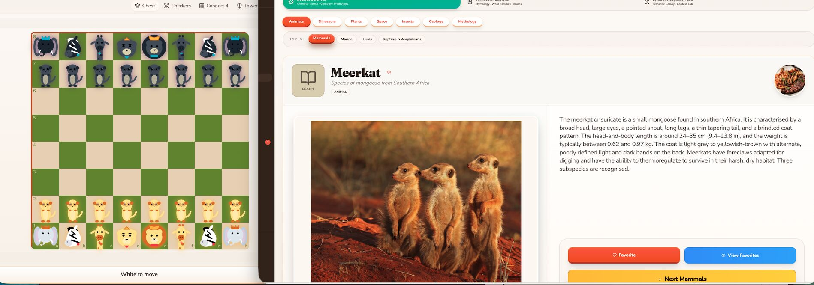

Hey guys... Brainiac noticed a cluster density in the kids behavioral cookies that were focused around African animals... looks like the meta data noticed you spent most of your time on the application browsing the pedia-- specifically the animals and even more specifically-- the animals located on the continent of Africa in the Savannah region.

It helps that the images that were recently uploaded to the family album ledger had location meta data left in them and i was able to extract that out and convert the coordinates into the real life place. You and grandma had an awesome time at the zoo.

And based off the co occurrence data we've established across individuals, location and time we know that this is something you and grandma have been doing for awhile. this is probably something special between you.

Things were starting to add up... so when Brainiac suggested creating a new batch of game skins themed around your developing interests- i said okay, that makes sense-

See that-- what I did there-- i made the AI do the work for me-- then at the critical point i inserted myself (human in the loop) validated this makes sense-- and then i let it rip through to production. Duh. If it can pass the guards, scheduled routine audits and meet the merge and commit requirements and hundreds of tests we already embedded into the repo thats cool.
#AI_PARENTING
#AI
#META_DATA
#SO_THATS_REINFORCEMENT_LEARNING
#ML_ON_HUMANS

​
​
​

