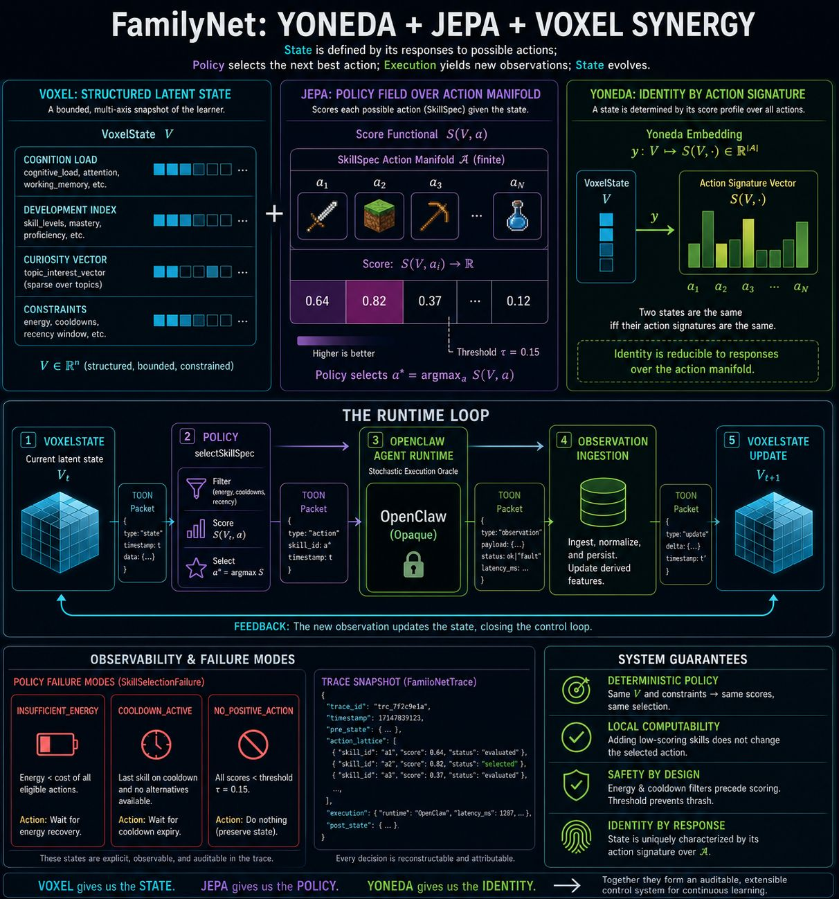

FamilyNet: Yoneda + JEPA + Voxel Synergy
What if a learner's identity wasn't defined by static labels, but by how they respond to opportunities, challenges, and experiences?
FamilyNet is a relational predictive world model where:
• Yoneda represents identity through interactions and responses.
• Voxels organize learning into structured contextual state spaces.
• JEPA predicts future latent states and selects the next best action.
Together, they create a continuous learning loop that adapts to the individual.
In practical terms:
By observing gameplay and learning behavior, the system can infer which themes, aesthetics, challenges, and rewards resonate with a player. It can then generate personalized game skins and experiences that align with the player's interests while encouraging outcomes such as persistence, strategic thinking, collaboration, curiosity, and mastery.
The goal isn't simply engagement.
The goal is aligning personalization with long-term growth and performance.
#CategoryTheory #KnowledgeGraphs #WorldModels #JEPA #PersonalizedLearning #AdaptiveLearning #DigitalTwins #AI #MachineLearning #SelfSupervisedLearning #GameBasedLearning #EdTech #FamilyNet

2
​
​

