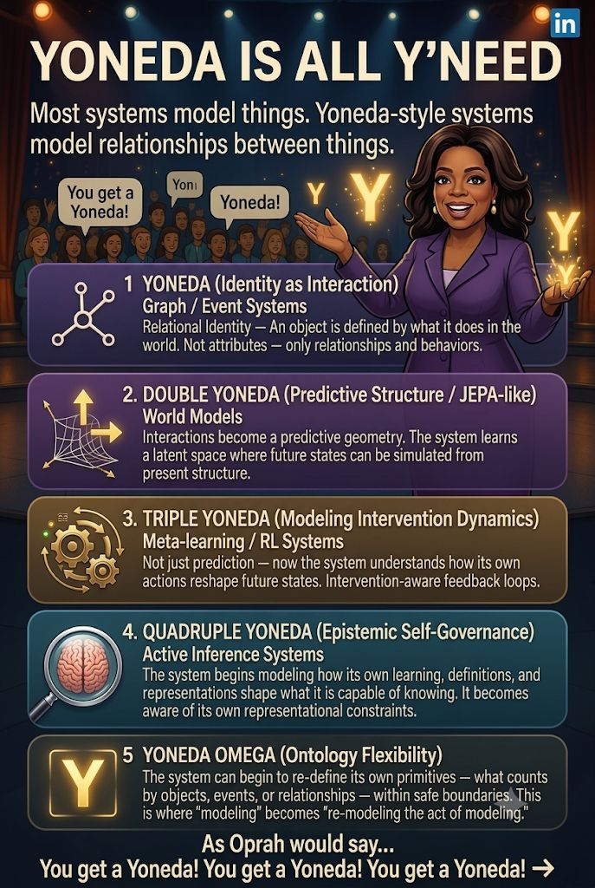

Yoneda is all y'need
What if intelligence isn’t about “knowing more”…
but about modeling deeper layers of relationships?
Most systems model things.
The next class of systems model how things relate, evolve, and reshape the space of possible relations itself.
Yoneda thinking pushes this further:
Identity = behavior
Prediction = latent structure
Action = feedback loops
Intelligence = self-aware modeling constraints
Omega = rewriting the rules of representation itself
At that point, you’re not building AI.
You’re building a system that understands how it understands.
This shows up as a layered structure:
Identity via interaction graphs
Predictive latent structure (JEPA-like)
Intervention-aware learning systems
Epistemic self-governance layers
Ontology-flexible modeling (Omega layer)
This becomes especially relevant for:
world models
agent systems
cognitive digital twins
multi-agent family OS architectures
Curious if anyone else is thinking about AI systems in terms of representation depth.
#CognitiveDigitalTwin #Yoneda #JointEmbeddings #KnowledgeGraphs #NotReallySponsoredByOprah

1
​
​

