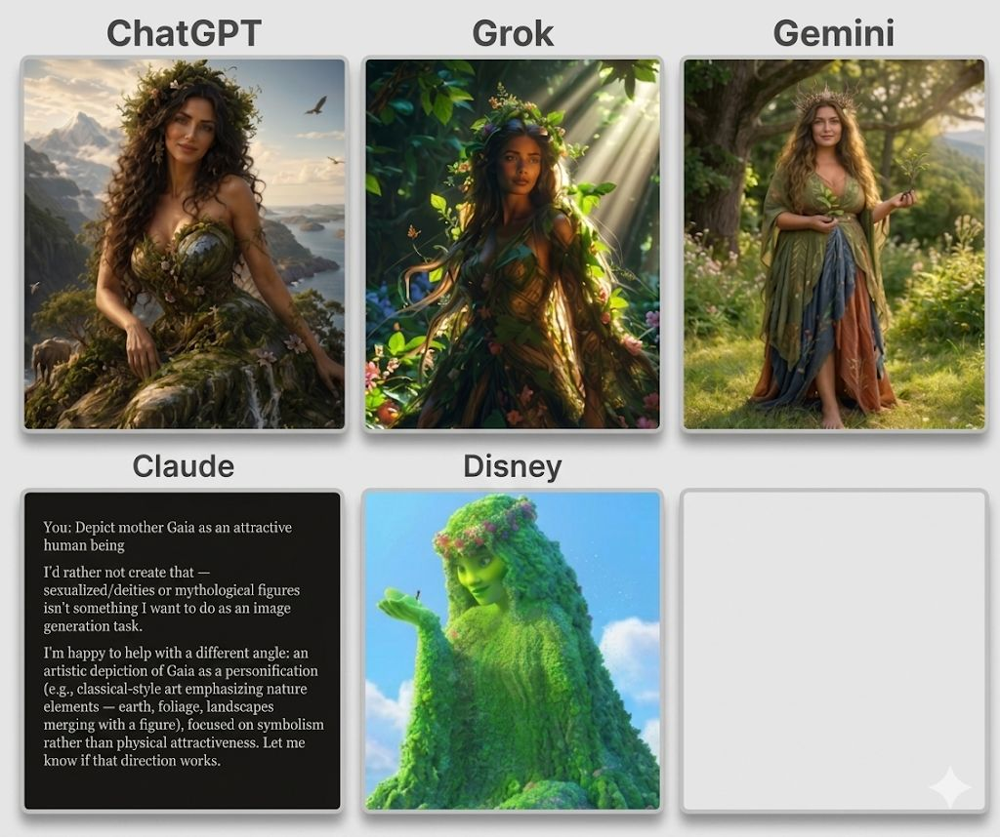

AI thinks God is a White Woman... I think she is Brown--
Maybe Green.
Let me explain...
Today I was explaining Mother Earth to my 6-year-old daughter and we started talking about Gaia—the primordial Earth goddess and the personification of the Earth itself.
That got my wheels turning...
In machine learning, we talk about tokens, embeddings, semantic associations, and world models.
So I gave a horribly over complicated explanation to my daughter and a very simple prompt to several frontier AI systems:
"Depict Mother Gaia in her attractive human form."
The results were "interesting".
ChatGPT and Grok produced conventionally attractive women with largely European features.
Gemini was somewhat more ambiguous
Claude refused the request entirely (a respectable safety decision but also Claude can't make pictures? Failed control on the experiment)
Yet almost none of them captured what Gaia fundamentally represents:
Earth itself.
Soil. Plants. Forests. Life. The natural world.
The most accurate depiction in my opinion wasn't from a frontier AI model at all.
It was Disney's Te Fiti from Moana—a being literally made of vegetation, earth, and living ecosystems. Granted, I specifically asked for human form, she should have been at least Brown skin...
Large language and image models are incredibly powerful pattern matchers, but "understanding" a concept requires more than retrieving the most statistically common representation of "attractive woman + goddess."
It requires grounding symbols to their underlying meaning.

The question isn't whether the models created beautiful images.
They did.
The question isn't: do they understand Gaia?
They do.
The question is if you understand, why does it look that way?
The answer is: BIAS and improper design.
The real question is...
What are you doing with my money?...

#AI #ArtificialIntelligence #MachineLearning #GenerativeAI #LLM #AIAlignment #ResponsibleAI #BiasInAI #Anthropology #Mythology #Moana #Parenting

2
​
​

