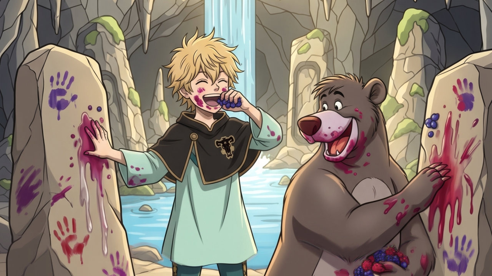

What biologically differentiates *us* from them? How did humans get smart?

Obviously... luck met cave berries.

Some ancient sapiens probably smeared pigment on a cave wall, looked at it, and unknowingly discovered the greatest technology in the history of Earth:

**Symbolic preservation.**

Intelligence? Animals have it. Tools? Animals have them. Communication? Everywhere. Culture? Also not uniquely human.

Elephants mourn their dead and carry migration knowledge across generations. Bees and ants operate as superorganisms. Crows and octopuses solve complex, multi-step problems.

We didn't win because we were the only species that could think.

We won because we learned how to leave thoughts behind.

Berries on stone became cave paintings. Cave paintings became writing. Writing became books. Books became the internet.

The moment information escaped the limits of a single brain and a single lifetime, evolution changed games. Knowledge no longer had to be reinvented every generation. It could accumulate. It could combine with ideas from distant cultures and distant centuries.

A hunter could learn from a farmer. A scientist could learn from a philosopher. A kid with a laptop could learn from all of humanity.

And now we're doing something even stranger.

We're converting the entire corpus of human knowledge into machine-readable representations. We're digitizing ALL of it.

So what happens if we inadvertently break that system? Gate keep it? Fragment it?

We quickly go back in time and hope Luck finds cave berries again...

So no, I'm not worried about the octopus.

I’m worried about whoever eats berries and controls the cave.

I've got my eye on you, Baloo.

#Frugivore #AI #AtomicKnowledgeUnits #CollectiveIntelligence #KnowledgeGraphs #InformationTheory #CognitiveScience #KnowledgeManagement #DigitalTransformation
