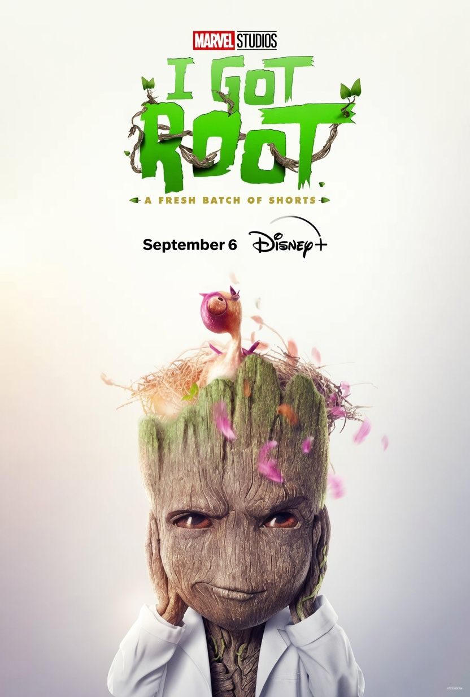

#IGOTROOT
Isomorphisms...wtf is that? am i right...?
Isomorphism = analogy....BUT better
Isomorphism ~ Pure Analog

Analogy says
These two sentences rhyme

Isomorphism says
The two sentences have the same grammar.

Wait...same grammar? That smells like POS (part of speech) tagging and chunking. It sounds like BS but it a'int.

I'd suggest incorporating some isomorphism capture into your daily aggregation campaigns. A lot of questions already have answers discovered in other fields and are just waiting to be applied.

Keep in mind-- a specialist persona isn't 100% siloed category knowledge... there's a MoE mixture of experts blend in there-- 60-20-20

Build the isomorphism engine...

**Know your keystones-- Know your model organisms-- Know your isomorphisms**

#IGOTROOT
#KnowledgeGraphs
#AI
#CategoryTheory
#GraphTheory
#FutureOfAI

1
​
​

