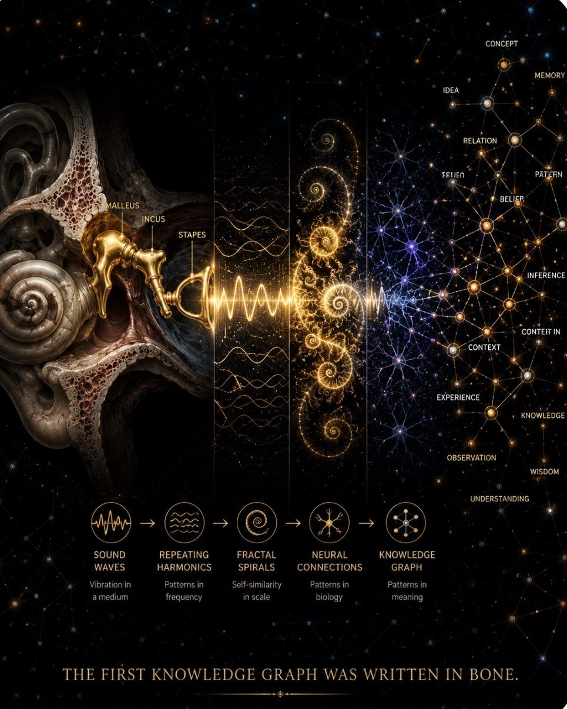

All about that bass… with treble. 🎵
That’s right. It’s biological.
It’s in your bones.
Literally — the tiny bones of your inner ear.
Sound is a symphony of relationships:
frequency, harmony, repetition, patterns.
Recursion.
Knowledge graphs.
Your brain has been building connections long before it had language to describe them.
The architecture of meaning isn’t something we invented.
It’s something we discovered inside ourselves.
#IGotRoot
#KnowledgeGraphs #Neuroscience #Cognition #AI #SystemsThinking
#AIAudio #WorldModel

1

