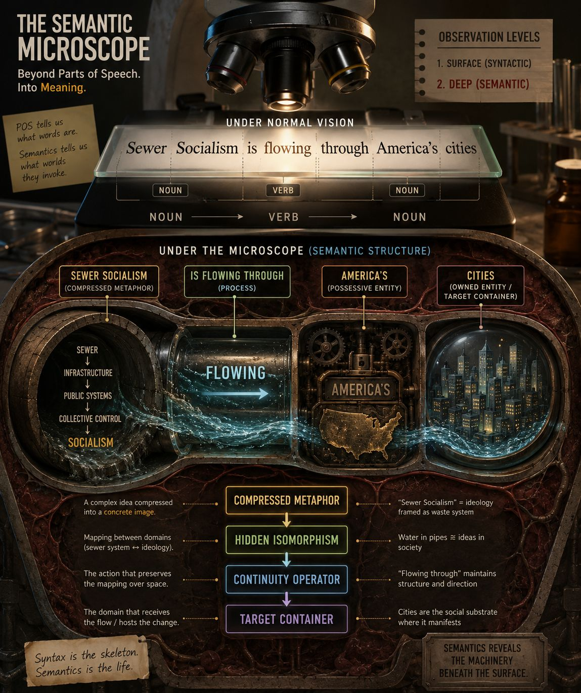

https://www.axios.com/2026/06/17/democratic-sewer-socialism-modern-reboot

**Cross-Domain Topological Mapping (CDTM)**
because what is being preserved is not merely "alignment" but geometry of relations:
Sewer system:
fluid
↓
flows
↓
through pipes
↓
inside infrastructure

Political movement:
ideology
↓
spreads
↓
through populations
↓
inside cities

The two domains share a path topology.
That is the hidden isomorphism.

**Conceptual Topology Tagging (CTT)**
Focus:
Meaning has topology:

Containers
Boundaries
Paths
Flows
Centers
Networks

So you annotate the geometry of thought.

Example:

IDEAS = SUBSTANCES
SOCIAL SYSTEMS = CONTAINERS
CHANGE = MOTION

Your sentence becomes a topology graph:

SOURCE: Sewer
|
| FLOW
v
TARGET CONTAINER:
American Capital

CONTAINER
PATH
SOURCE-GOAL
FORCE

Metaphorical Frame Alignment (MFA)
Focus:
Which frames are activated, and how are they aligned?

Example:

SEWER FRAME
- liquid
- flow
- pipes
- diffusion

CAPITAL SYSTEM FRAME
- money
- institutions
- networks

ALIGNMENT:
fluid movement ↔ ideological/economic spread
… more

0

