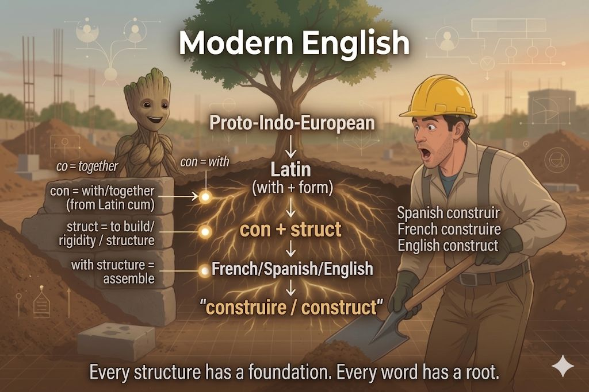

con tu madre… 
with your mother...?
that got my wheels spinning--just not why you think
i’m in the residential construction industry so naturally I went to:
con-struct-ion
construct/structure/ infrastructure /destruction

Spanish “construir”
French “construire”
English “construct”

co=together
con = with

struct = structure / rigidity

with structure?… assemble with?

so wait… 'con' isn’t even Spanish? It's deeper than that? I was basically brushing up against Latin 'cum'?

so you're saying when I study Latin, I’m not just learning one language… I’m learning a shared root system that splits into multiple languages?

and with LLMs and agents, language itself is like the execution layer

so studying Latin would be a major and obvious amplifier effect now and for the foreseeable future for both myself and my children??

Yes, that is exactly what i'm saying-- enjoy your studies friends!

#IGotRoot
#Latin
#NLP
#Morphology
#KnowledgeGraphs
#AI
#AmplifyYourKnowledge

2

