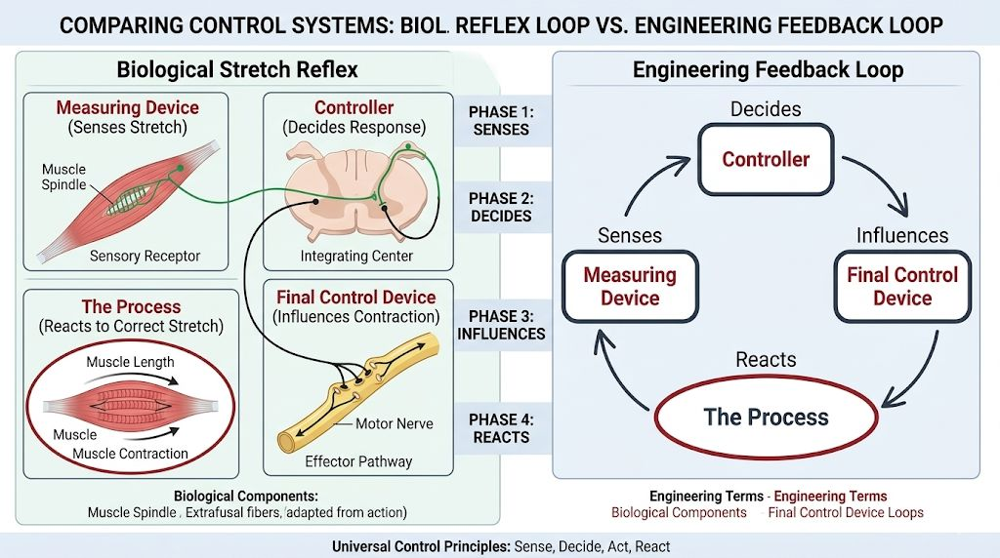

Fancy Feast For Friday Friends! 🐱
If you're building in AI, I've got something for you to chew on.
Loops — I've got a beautiful loop isomorphism for you.

The biological stretch reflex (muscle spindles) is basically a **state derivative sensor** feeding a fast feedback controller. 

That's your model organism.

My loops usually look like this:
System  
↓  
Sensor  
↓  
State Estimate  
↓  
Controller  
↓  
Corrective Action  
↓  
System

The classic Sense → Decide → Act → React cycle, whether it's biology or silicon.

What does yours look like?

#IGotRoot
#ControlTheory #BioInspiredAI #FeedbackLoops #WorldModels #KnowledgeGraphs #Isomorphism

