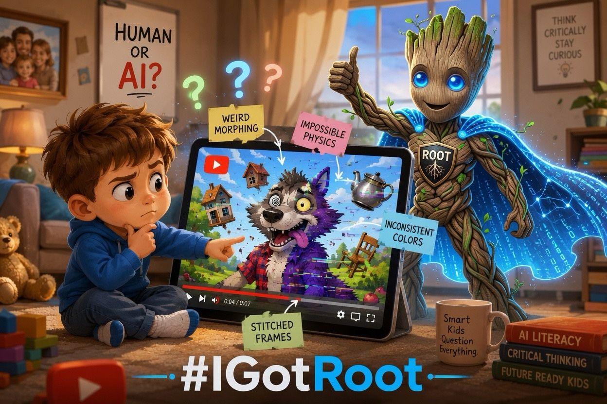

This is awesome.

My 3-year-old, can fairly accurately and consistently identify AI-generated videos on YouTube.

I started watching YouTube slop with the kids back when most AI video accounts were limited to generating 4–8 second clips. They were obviously stitched together.

But hey… they taught the Big Bad Wolf okay-ish for a while.

My wife hated it. Rightfully so.

The characters morphed. The continuity was terrible. Physics was optional. It was absolute trash.

We kept watching.

In secret.

Only when Mom wasn’t around.

Then she’d come around the corner and the kids would yell:

“Mom’s not gonna like this!”

Busted.

Over and over for months.

Now the quality has gotten dramatically better.

But it’s still slop.

And Mom still doesn’t like it.

But there’s something happening I didn’t anticipate...

My kids have been growing up alongside generative AI. They’ve watched the technology evolve from obvious stitched-together nonsense into something increasingly believable.

And they’re developing an intuition for the tiny tells:

• weird motion
• impossible transformations
• inconsistent objects
• uncanny facial expressions
• stories that don’t quite make sense

They’re learning to ask:

“Was a human actually behind this?” “How much effort went into creating this?”

What an incredible skill to develop right out of the gate.

Previous generations learned to tell advertising from entertainment, Photoshop from reality, and clickbait from journalism.

This generation may learn to distinguish synthetic media from human creativity.

They’re learning how to tell the difference between AI and human like their lives depend on it.

Because right now, to them, the ability to watch or not feels like it.

And someday…

the ability to recognize what is real, what is synthetic, and what is intentionally deceptive may be one of the most important literacies they ever develop.

#IGotRoot
#AILiteracy
#DigitalLiteracy
#FutureOfEducation
#CriticalThinking
#GenerativeAI
#AIParenting
#MediaLiteracy
#FutureReadyKids
#ResponsibleAI

2

