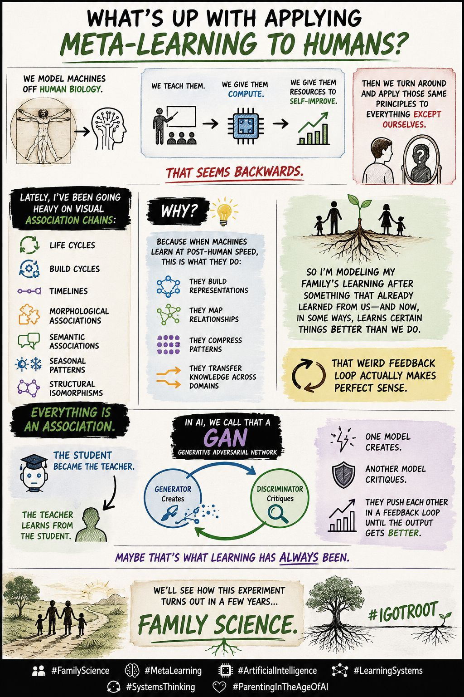

Atlanta Metropolitan Area

Kohler Co.

Get 4x more profile views with Premium

Reactivate Premium: 50% Off

Profile viewers

92

Post impressions

4,302

Feed post

Lucas Pearson

 
 • You

Sales Consultant | Bug Bounty Hunter | SoftwareDev #IGotRoot #AlwaysBeBuilding

2mo • 

What’s up with applying meta-learning to humans?

We model machines off human biology.

We teach them.
We give them compute.
We give them resources to self-improve.

Then we turn around and apply those same principles to everything except ourselves.

That seems backwards.

Lately, I’ve been going heavy on visual association chains:

* Life cycles
* Build cycles
* Timelines
* Morphological associations
* Semantic associations
* Seasonal patterns
* Structural isomorphisms

Everything is an association.

Why?

Because when machines learn at post-human speed, this is what they do: they build representations, map relationships, compress patterns, and transfer knowledge across domains.

So I’m modeling my family’s learning after something that already learned from us—and now, in some ways, learns certain things better than we do.

That weird feedback loop actually makes perfect sense.

The student became the teacher.
The teacher learns from the student.

In AI, we call that a GAN—a generative adversarial network.

One model creates.
Another model critiques.

They push each other in a feedback loop until the output gets better.

Maybe that’s what learning has always been.

We’ll see how this experiment turns out in a few years…

Now that’s Family Science!

From a cognitive development standpoint, what age do you think would be appropriate to introduce this?

#IGotRoot 🌱
#FamilyScience
#MetaLearning
#ArtificialIntelligence #AI
#LearningSystems
#SystemsThinking
#ParentingInTheAgeOfAI

1

