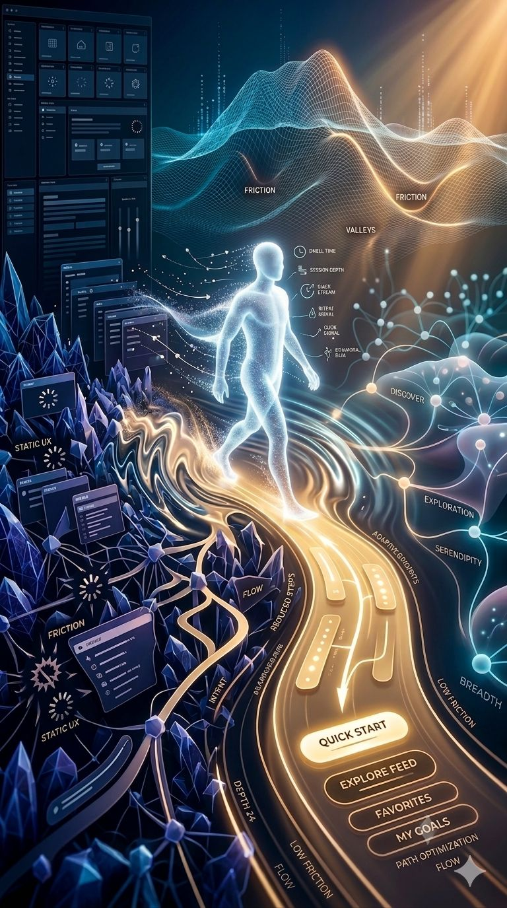

We’ve been thinking about “personalization” at the wrong layer.
Most systems personalize content:
what you see, what gets recommended, what gets ranked.

But the real leverage point isn’t the content.

It’s the shape of the experience itself.
I’ve been thinking about this as:
content friction management.

Instead of asking “what should this user see?”, the better question is:
what is the lowest-friction path for this user to reach an outcome?

Behavioral signals (click patterns, dwell time, navigation depth, hesitation points) don’t just tell us preference.

They reveal how a user moves through structure.

Some users are goal-driven—fast in, fast out.
 Others are exploratory—optimizing for coverage and discovery.

And once you can infer that, you don’t just rank content differently.

You reshape the interface topology itself.

That means adjusting:
depth vs breadth of navigation
number of decisions per screen
shortcut density vs exploration space
distance between intent and outcome

We move from static UX with personalized ranking
 → to adaptive UX graphs that reconfigure around behavioral friction.

The system stops being a page.

It becomes a navigation structure that adapts to how you move.

Experience isn’t something layered on top of the product.

It is the product.
And the next step isn’t better recommendations.
It’s minimizing execution friction through dynamic interface morphology.

#IGotRoot
#UXDesign #ProductDesign #AI #HumanComputerInteraction #SystemsThinking #MachineLearning #WorldModel

