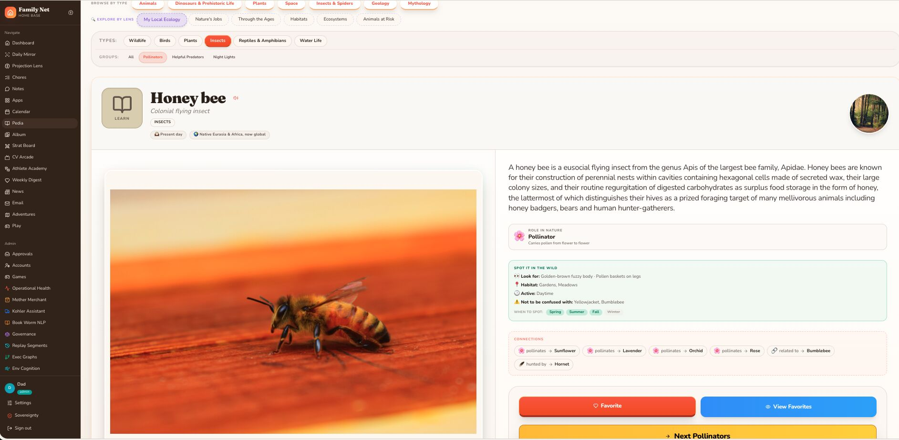

Atlanta Metropolitan Area

Kohler Co.

Get 4x more profile views with Premium

Reactivate Premium: 50% Off

Profile viewers

92

Post impressions

4,301

Feed post

Artificial Intelligence Exchange | AI Strategy, Engineering, Research & Applications

Lucas Pearson • You

2mo • 

Hey there…
You want to model? You want to get paid?
Start here.

Not with abstract theory.
Start with something real.
Ecology. 
**Build Your Pedia**

Take an ecosystem—any ecosystem.
Now structure it properly:

Every organism is a node.
 Every relationship is an edge.

Who eats who.
 Who produces energy.
 Who depends on whom to survive.

Plants → herbivores → carnivores → apex predators.
 Decomposers closing the loop.

What you’re building is not a diagram.
It’s a living ecological graph.
And once you represent it this way, something important happens:
Ecology stops being memorization.
It becomes traversal.
Energy flow becomes pathing.
 Food chains become computation.
 Ecosystems become navigable structure.

This is the foundation of the Pedia project:
A natural science knowledge graph where understanding emerges from traversal of relationships.

Because once knowledge is structured as a graph…
You don’t learn about the system.
You learn through the system.

This is why ecology is the optimal case study.
Unlike most domains, it is already rigorously defined—its taxonomy is established, and its topology is well studied. The structure already exists in the real world.

Your job is not to invent the system.
It’s to reconstruct it as a graph.

Species, interactions, and energy flow are already defined—you’re encoding an existing reality into nodes and edges, then making that structure navigable.
And in doing that, something deeper clicks:
You’re not just building an ecological model.
You’re learning what a graph actually is.

Because once you construct enough of these systems—once you move from single-domain graphs into layered abstractions of graphs-of-graphs—you stop seeing isolated relationships and start recognizing recursive structure everywhere.

Ecology isn’t just a starting point.

It’s the cleanest possible entry into thinking in graphs.

#IGotRoot
#MachineLearning
#KnowledgeGraphs
#GraphOfGraphs
#WorldModeling
#SystemsThinking
#ArtificialIntelligence
#AIParenting
#IntentionalParenting
#FutureOfEducation

1

