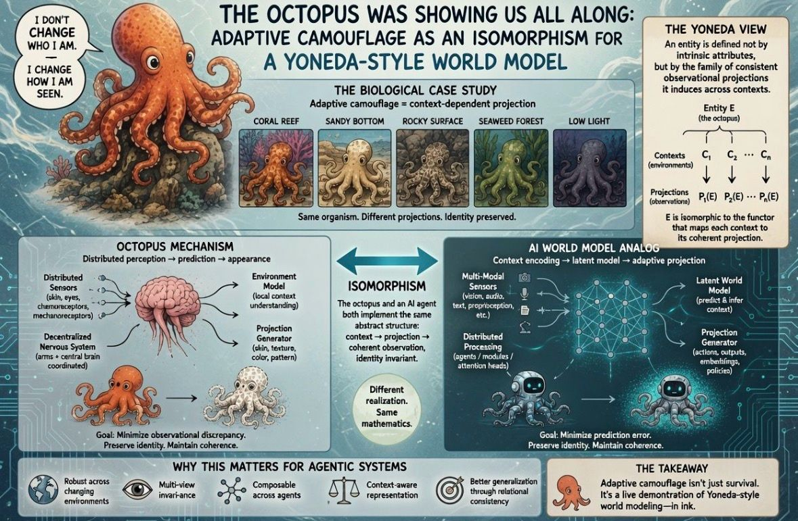

2mo •

One of my biggest misses from the early GPT-3 era was not following my own intuition.
Back then, I became obsessed with the octopus as a model organism for Al—not because of "intelligence" in the usual sense, but because of its distributed nervous system, dense sensory integration, and adaptive behavior.
Then I got pulled into swarm intelligence, multi-agent systems, and collective optimization.
Looking back, maybe I should have stayed with the octopus.
Its adaptive camouflage isn't just a biological trick-it's an isomorphism for a Yoneda-style world model.
The octopus doesn't carry a single fixed representation of itself. Instead, it generates the projection of itself that is most coherent with its current environment — all while preserving its underlying identity.
This is strikingly similar to the idea that an entity is defined not by a static list of intrinsic attributes, but by the family of consistent observational projections it induces across contexts.
Viewed this way, adaptive camouflage becomes more than an evolutionary hack. It's a biological case study in context-dependent representation learning and multi-view invariance.
Maybe the octopus wasn't just an inspiration for distributed intelligence.
Maybe it was quietly demonstrating the architecture of advanced world models all along.
#CategoryTheory #YonedaLemma
#RepresentationLearning
#WorldModels
#CognitiveArchitecture #Biologicallntelligence #AdaptiveSystems
#Emergence
#IGotRoot
#JointEmbeddings

1

