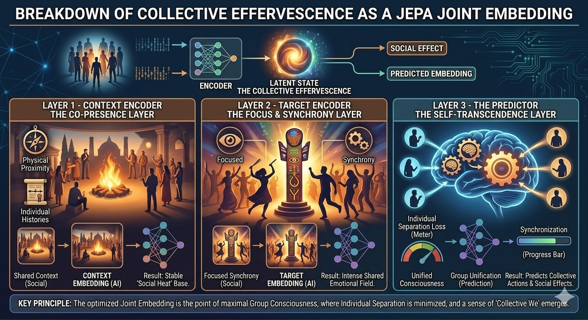

Atlanta Metropolitan Area

Kohler Co.

Get 4x more profile views with Premium

Reactivate Premium: 50% Off

Profile viewers

92

Post impressions

4,300

Feed post

Lucas Pearson

 
 • You

Sales Consultant | Bug Bounty Hunter | SoftwareDev #IGotRoot #AlwaysBeBuilding

2mo • 

What if JEPA was first observed in human societies?

Durkheim's *collective effervescence* describes what happens when groups synchronize through ritual, chant, or shared attention: individuals temporarily dissolve separation and converge into a state of meaning no single mind fully contains.

This is structurally identical to Joint Embedding Predictive Architecture.

JEPA doesn't reconstruct raw inputs. It learns by aligning internal representations in latent space—predicting *structure*, not surface. The correspondence runs deep:

- Rituals → iterative training loops reinforcing shared representational structure
- Symbols → compressed latent tokens encoding cultural priors
- Synchronization → convergence toward a joint embedding of reality

Durkheim was describing distributed representation learning in human collectives—a century before the math existed.

LeCun formalized the computational substrate: intelligence emerges from predicting and aligning in latent space, not from reconstructing raw observations.

Two frameworks. One principle.

Durkheim: the emergent dynamics of alignment in social systems.
LeCun: the formal architecture for the same process in learned systems.

JEPA isn't a new idea. It's a precise restatement of how distributed systems—biological or artificial—converge on shared models of reality.

The math caught up to the anthropology.

Can you think of other concepts—from any domain—that share this same root isomorphism: distributed systems converging on shared representations without a central coordinator?

Drop them in the comments.

#IGotRoot
#JEPA #DistributedIntelligence #CollectiveIntelligence
#WorldModels
#AI
#Isomorphism
#Anthropomorphism
#JointEmbeddings
#Layers
#SymbolicAI

1

