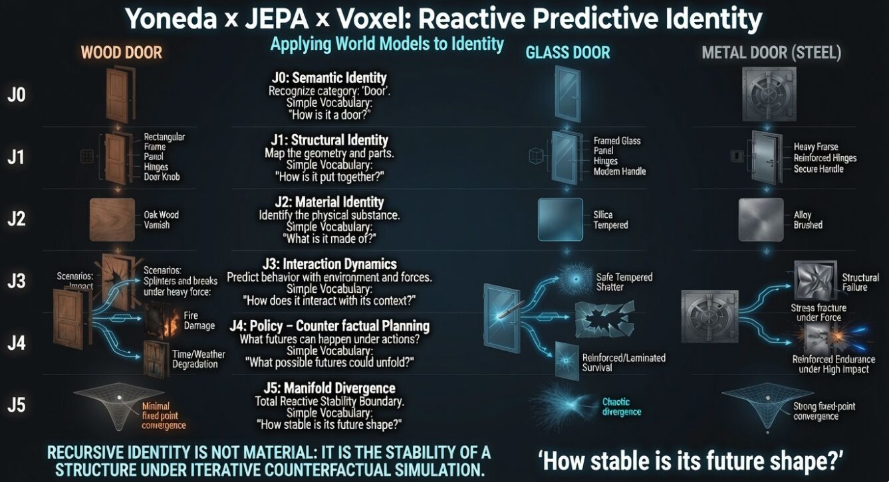

2mo •

Identity as a Recursive Future Manifold
We usually define identity by static traits: appearance, labels, materials, or résumés.

A steel door is “just a steel door.”
A person is their job title or backstory.
An AI is its architecture.

But these are frozen snapshots.

What if identity isn’t what something is, but what it becomes under pressure?
Apply force.
Add uncertainty, scarcity, social dynamics, high stakes.
Then watch the traversal — not the starting state, but the trajectory through possible futures.

Look at the three doors:
Wood door: Absorbs moisture, splinters, decays over time.
Glass door: Shatters under impact.
Steel door: Endures, sometimes even strengthens under stress.

They share the same semantic label (“door”) and structural role (“barrier”), yet their future manifolds diverge dramatically. The difference isn’t the label. It’s the response landscape — how each structure stabilizes (or fails to) under iterative interaction with the world.

The same principle applies to people and systems.

Most of us can describe who we think we are.

Far fewer can predict who we become when hit with real pressure, incentives, fear, responsibility, or opportunity. 
Character often only reveals itself in hindsight — because identity is observed through traversal, not introspection alone.

This is where the Yoneda × JEPA × Voxel lens becomes powerful:

Yoneda: An entity is defined by its relationships and interactions.

JEPA: Intelligence arises from predicting how latent states evolve under different conditions.

Voxel World Models: Identity becomes spatially and temporally embedded in a predictive simulation of the environment.

Together they suggest:
Identity is not material. It is not a label. It is not a fixed state.
Identity is the stability and shape of a structure as it recursively interacts with the world — its measured traversal through counterfactual futures.

Or more simply:
It’s not who you say you are.
It’s the shape of the futures you consistently create when the world pushes back.

The image below visualizes this recursive predictive identity across levels of abstraction (J0–J5):

Recursive Identity is not material — it is the stability of a structure under iterative counterfactual simulation.

How stable is your future shape?

Yoneda × JEPA × Voxel
Predictive Identity • World Models • Representation Learning

#PredictiveIdentity #WorldModels #JEPA #Yoneda #RepresentationLearning #SystemsThinking #ComplexSystems #Causality #MachineLearning #AI

1

