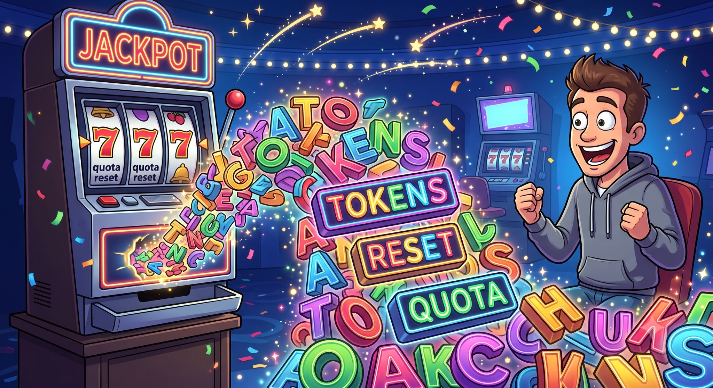

2mo •

I’m guilty of misusing the term “world model.”
Ask yourself—are you too?
Most of what we're calling “world models” are really just early digital twins… and fairly basic at that...

We’re missing the core lens:
Entity as model organism.
Joint embedding the parts of an entity together—that’s the first step toward “it exists.”
JEPA the organs.

But even then, nothing exists in isolation. Everything is co-defined by interaction, environment, and other agents.
So the system has to include it all:
Other agents. Other inhabitants. Topography. Environment. Dynamics. Constraints. Interaction.
Not as a backdrop.
As the substrate.

A world model isn't a model of a world.
It's a living ecosystem of coupled digital twins evolving within a shared latent universe.

Model Organism JEPA.

MO-JEPA.

First the organs.
Then the organism.
Then the ecology.

MO-JEPA 
MORE HONEY MORE MONEY 
😅 🤣 😂 😇

#IGotRoot
#DigitalTwin
#WorldModel
#JEPA
#Yoneda
#AI

1

