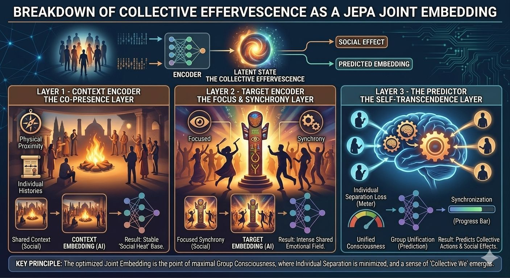

2mo •

What if joint embeddings were first observed in human societies?
Durkheim's collective effervescence describes what happens when groups synchronize through ritual, chant, or shared attention: individuals temporarily dissolve separation and converge into a state of meaning no single mind fully contains.
He wasn't describing one signal. He was describing many — joined.
→ Proximity: spatial co-location as a shared coordinate frame
 → Posture: synchronized bodies, one kinesthetic stream
 → Faces: smiles as high-bandwidth affective tokens
 → Voices: chant, tone, and rhythm binding audio to meaning
Each channel alone is ambiguous. Joined, they lock into a single latent representation that no individual channel — and no individual mind — carries alone.
That's the mechanism. Ritual doesn't transmit content. It aligns modalities. Sacred meaning is the joint embedding.
And here's why the convergence needs no coordinator: everyone in the ritual receives the same synchronized multimodal bundle, at the same moment, under the same alignment pressure. Same inputs, same objective, same latent space. Every mind converges independently — and arrives at the same place.
LeCun's joint-embedding architectures formalized the substrate a century later: intelligence emerges from aligning representations across streams in latent space, not from reconstructing any single one. CLIP binds image to text. ImageBind binds six modalities. Durkheim's ritual binds proximity, posture, face, and voice.
Two frameworks. One principle. The math caught up to the sociology.
So here's the question: what other concepts — from any domain — share this root isomorphism? Distributed systems converging on shared representations, no central coordinator required. Drop them in the comments.
#IGotRoot #JointEmbeddings #WorldModels #CollectiveIntelligence #Isomorphism

2

