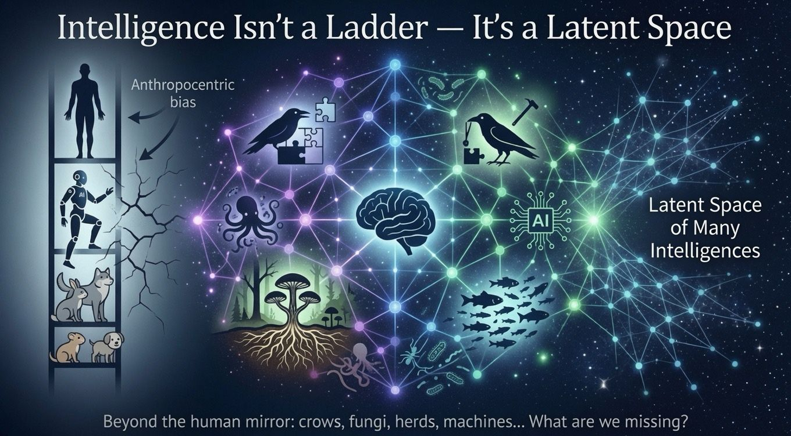

1mo •

Consider your bias and prejudice. 
All of them. 
Yes, including your speciesism 

A quiet assumption drives the current "superintelligence" conversation: we talk as if intelligence sits on a single ladder, with humans at the top, machines approaching, and everything else beneath notice.

This framing hides a fundamental flaw: we haven’t agreed on what intelligence actually is.

The dominant narrative reduces it to computation, language, and speed—making it measurable and marketable. But this compresses a vast space of adaptive systems into a narrow band of what simply looks "like us."

This bias doesn’t start with AI research. It starts much earlier.
From childhood fables, we're taught a hierarchy of agency. Animals are assigned human intentions—the clever fox, the foolish crow. We learn to interpret non-human intelligence through a human mirror. Human cognition becomes the implicit standard; everything else is just a distortion or caricature.

That early framing scales. We universally default to ourselves as the reference frame. In a kind of anthropocentric recursion, "real intelligence" becomes whatever most closely resembles our own thinking. It’s a species-level constraint on perception: we build our model of intelligence from the inside out.

This constraint shapes how we interpret animal behavior, design institutions, and define machine intelligence. Speciesism isn't just an ethical stance about harm; it’s a cognitive filter dictating what qualifies as intelligence at all.

A crow solving multi-step problems. A fungal network redistributing forest resources. A herd dynamically adapting to shifting constraints. These aren’t metaphorical—they are alternative computational architectures for survival and coordination.

Yet, they rarely enter the same conceptual space as “AI progress.”
Instead, the conversation circles one question:
“How close are we to superintelligence?”
We skip the more basic question:
“What are we counting as intelligence—and why does it so consistently resemble us?”

If intelligence is defined too narrowly around human cognition, what we call "progress" is just convergence toward ourselves. Not discovery—just reflection.

A more interesting framing is that intelligence isn’t a ladder at all, but a latent space of many forms—

#AI #Intelligence #SystemsThinking #CognitiveBias #PhilosophyOfMind #CognitiveScience #FutureOfAI #Education
#IGotRoot

1

