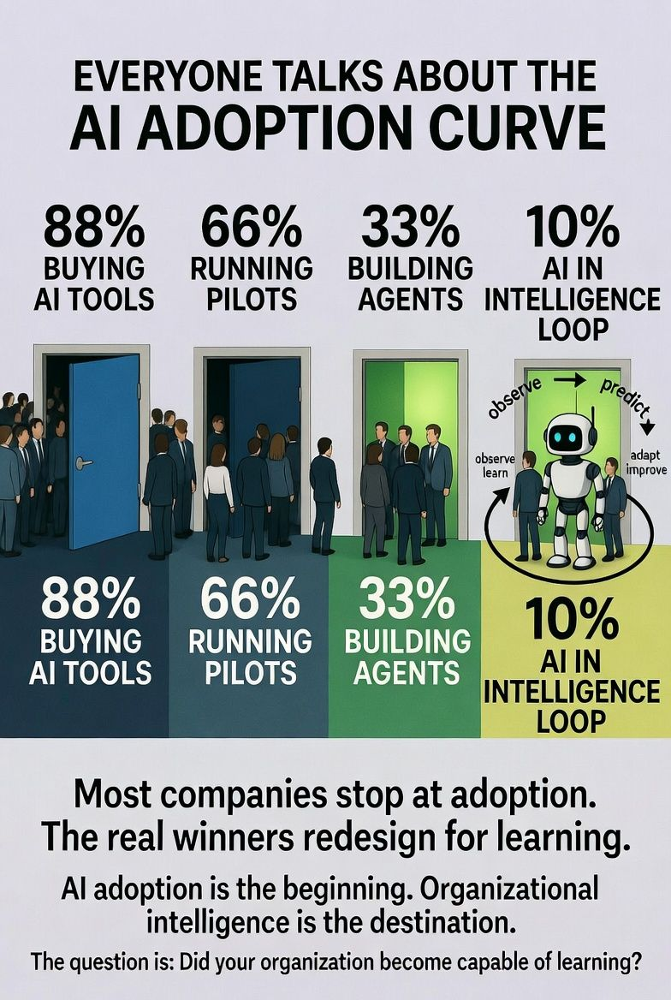

Atlanta Metropolitan Area

Kohler Co.

Get 4x more profile views with Premium

Reactivate Premium: 50% Off

Profile viewers

92

Post impressions

4,298

Feed post

Lucas Pearson

 
 • You

Sales Consultant | Bug Bounty Hunter | SoftwareDev #IGotRoot #AlwaysBeBuilding

1mo • 

Everyone talks about the AI adoption curve.
But I think we are measuring the wrong thing.

The question isn't:
"How many AI tools did your company buy?"

The question is:
"Did your organization become capable of learning?"

Most companies stop here:
→ Buying AI tools
→ Running pilots
→ Building agents

The real transformation happens when AI stops being a tool attached to the organization...
and becomes part of the organization's intelligence loop.

The next generation of companies won't just automate workflows.
They will build systems that:
• observe
• learn
• predict
• adapt
• improve

The competitive advantage won't be who has access to AI.
Everyone will.

The advantage will belong to the organizations that can learn faster than their environment changes.

AI adoption is the beginning.

Organizational intelligence is the destination.

#IGotRoot
#SystemsThinking
#OrganizationalIntelligence
#AgenticAI
#WorldModels
#FutureOfWork

2

1

