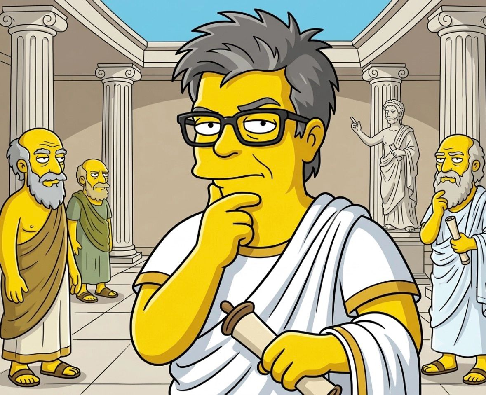

1mo • 

Too funny.

Everyone talks about the “godfathers of AI.”

And that’s deserved. It’s heroic.

But heroic isn’t the same as legendary.

Long before artificial intelligence, Homer was exploring something even more fundamental:

Agency.

If you want to understand the future of AI agents, reread The Odyssey — not just as mythology, but as an early study in world models, prediction, and control.

The Sirens weren’t just a monster story.

They were a metaphor for an adversarial signal that hijacks an agent’s internal model of reality. A melody so compelling it overrides the sailor’s predictive model and redirects behavior toward a false objective.

A JEPA-like idea hidden in poetry:

The agent acts not on raw reality, but on its internal representation of the world.

The Lotus-Eaters?

A story about reward optimization gone wrong.

An agent receives a powerful reward signal, loses its long-term objective, and collapses into a locally optimal state.

The Odyssey is not just a hero’s journey.

It is a journey through the problems every intelligent system must solve:

* maintaining a coherent world model
* resisting deceptive objectives
* balancing exploration and reward
* preserving identity across time

Heroes get remembered.

Legends never die.

Maybe Homer wasn’t just writing mythology.

Maybe he was writing the first architecture diagram for agency.

#Homer #AI #WorldModels #JEPA #Agents #ArtificialIntelligence #SystemsThinking #IGotRoot

1

