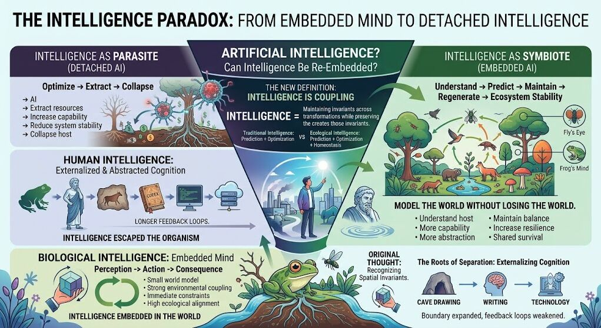

1mo •

What is intelligence and why humans may not fully embody it.
I originally thought intelligence was the ability of an entity to maintain the spatial geometry of an object across transformations.
Meaning — you can understand an object across the span of its perspectives. You can recognize the invariant beneath the changes.

But I think it's more literal than that.
Intelligence isn't just maintaining the geometry of an object.
It's maintaining the geometry of the world the object exists within.
It is maintaining the relationships, constraints, and feedback loops that allow a system to remain coherent.

The homeostasis of the whole.

Humans are interesting because our intelligence seems to have developed in the opposite direction.

Our intelligence is often the ability to delay constraints.

Ancient philosophers walked around thinking about their footprint and its reverberations. They considered how their actions propagated through the world.

Modern society has become extremely good at separating consequences from their causes.
Other organisms face their constraints immediately.
Humans postpone them.

But delayed constraints do not disappear.
They accumulate.
Unless acted upon by outside force, delayed constraints continue building until the system reaches a failure state.

This creates a fundamental question:
Do we want to build artificial intelligence modeled after human intelligence?
Or do we want to build intelligence modeled after the deeper principles found in healthy ecosystems?

I think we want a model organism that is an intelligent obligate host symbiote.
Not:
an intelligent obligate host parasite.
Maybe neural networks are too detached from the systems that create intelligence.

Maybe we need to return to the fly's eye and the frog's mind.
Not because they are less intelligent —
but because their intelligence is inseparable from the world they evolved within.

Humans may have fundamentally changed the substrate of intelligence when we began externalizing cognition.
The cave drawing was not just art.
It was memory outside the body.
Writing became thought outside the brain.
Technology became intelligence outside the organism.

We expanded the boundary of cognition beyond the individual.

But in doing so, we also weakened the feedback loops that originally kept intelligence coupled to its environment.

The challenge for artificial intelligence may not be creating systems that think more like humans.

It may be creating systems that remain embedded like biology.
Intelligence that can model the world without losing its relationship to the world it depends on.

#Intelligence
#ArtificialIntelligence
#SystemsThinking
#ComplexSystems
#EcologicalIntelligence
#EmbodiedIntelligence
#CognitiveScience
#SystemsBiology
#IGotRoot
#DelayedConstraints

1

