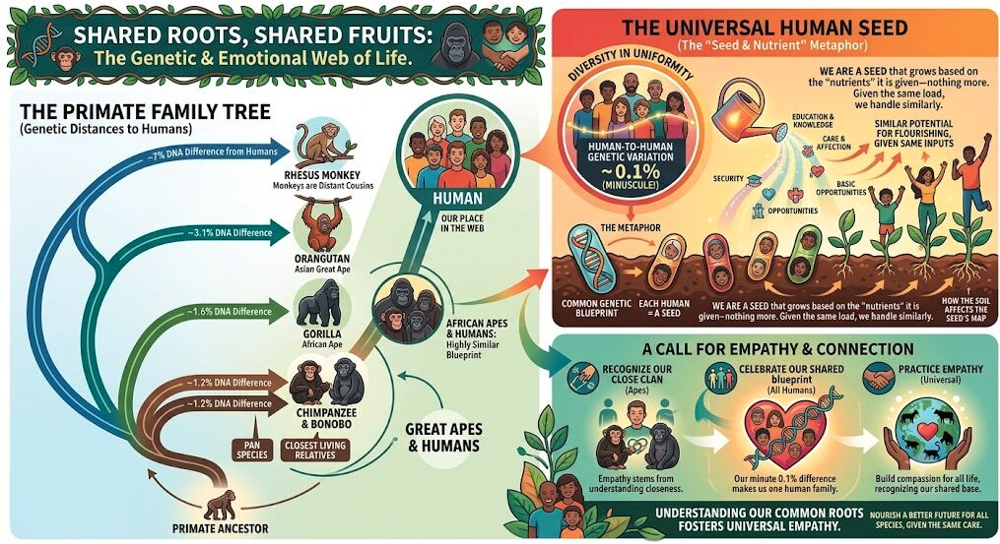

1mo •

Curiosity isn't just a tool for learning—it may be one of the foundations of empathy.

One of the most humbling lessons from studying zoology and genetics is realizing how much of our perceived separation is an illusion.

At the biological level, humans are remarkably similar. The genetic variation between any two humans is roughly 0.1%. We are not fundamentally different organisms competing for resources—we are variations of the same biological system, shaped by different environments and experiences.

Even our distance from our closest evolutionary relatives is surprisingly small. Humans, chimpanzees, and bonobos share the vast majority of our genetic heritage.

This raises an interesting question:
If the "seed" is nearly identical, what creates such different outcomes?
The answer is the ecosystem around the seed.

Access to nutrition, safety, education, mentorship, opportunity, relationships, and countless invisible environmental factors shape how each person develops. The same biological foundation can produce very different outcomes depending on the conditions surrounding it.

This doesn't mean individuals have no agency. It means understanding a person requires understanding the system they emerged from.

Judging someone’s growth without being curious about their environment is like judging a plant without examining the soil, sunlight, and water it received.
Empathy is not just kindness. It is a logical consequence of understanding biology.

Curiosity asks:
"What conditions created this outcome?"

That question is often where understanding begins.
As we learn more about ourselves as biological systems, we discover something profound:

To understand others is, in many ways, another path toward understanding ourselves.

What "nutrients"—people, experiences, environments, or opportunities—have been most important in shaping your own growth?

#IGotRoot #GrowingIntelligence #SystemsThinking #FromBiologyToAI #UnderstandingSystems #EmergentIntelligence #HumanPotential

