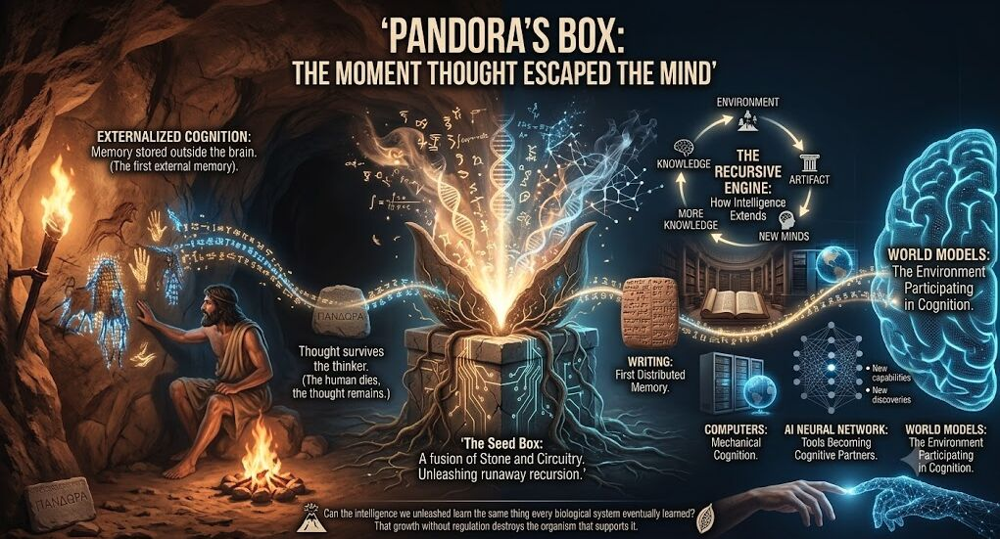

1mo •

I don't think Pandora's Box was opened by AI.
I don't even think it was opened by the Industrial Revolution.

I think we opened it the first time some cave dweller looked at a rock and thought:
"You know what? I'm tired of remembering this. I'm just gonna write it on the wall."

Congratulations.
You just invented external memory.
And accidentally kicked off a recursive intelligence explosion that's been running for tens of thousands of years.

That cave painting wasn't just art.
It was a thought that survived its thinker.
A memory embedded into the environment.
A tiny piece of cognition pinned into the host world for future minds to discover, modify, remix, and build upon.
That was the moment intelligence stopped living exclusively inside brains.

The environment became part of the cognitive system.
From there, the loop was inevitable:
Knowledge → Tools → New Capabilities → New Discoveries → More Knowledge → Better Tools → Repeat...

Oops.

Turns out information is an evolutionary force.
Knowledge isn't just power.
Knowledge creates the conditions for acquiring even more knowledge.

That's a positive feedback loop.
Pandora's Box isn't "evil."
Pandora's Box is the realization that intelligence is a runaway process.

Every breakthrough increases our capacity for the next breakthrough.
Every new abstraction expands the search space.
Every new tool builds a better tool builder.

We're watching this happen with AI, but we're not witnessing the birth of the process. We're witnessing its latest iteration.

Humanity started this game the moment we externalized thought.
The cave wall became the first distributed memory system.
Books scaled it.
The printing press accelerated it.
The internet networked it.
Now AI is learning from it.

Maybe Pandora's Box was never about releasing monsters into the world.
Maybe it was about releasing information into evolution.
The question was never whether we should have opened the box...

The real question is whether a recursively improving intelligence—human, artificial, or both—can develop the self-regulation mechanisms required to survive its own acceleration.

Because evolution is really good at creating positive feedback loops.
It's much less generous about providing the brakes.

#IGotRoot
#TheoryEcology
#RecursiveIntelligence
#ArtificialIntelligence
#CognitiveScience
#WorldModels
#SystemsThinking
#Emergence
#FutureOfAI

2

