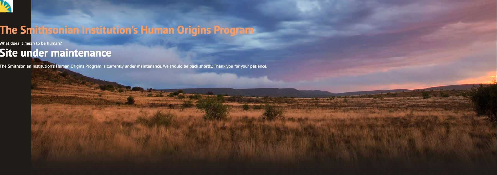

1mo •

This just gives me all sorts of sketch vibes.
A strange thing happens when a civilization’s memory goes offline.
The Smithsonian Human Origins Program website is currently undergoing maintenance.
Maybe it is routine. Maybe it is a redesign. Maybe it is nothing.
But moments like this highlight something deeper:
Our understanding of ourselves depends on fragile information systems.
The story of humanity — our fossils, genetics, migrations, and evolutionary history — increasingly lives inside digital infrastructure. When those systems change, disappear, or get rewritten, we are reminded that knowledge preservation is not just a technical problem.
It is a civilizational one.
The next frontier may not only be discovering new knowledge.
It may be building systems capable of preserving, validating, and transmitting humanity’s accumulated understanding across generations.
The archive is part of the organism.
#HumanOrigins #Evolution #AI #KnowledgeArchitecture #IGotRoot #SiteMaintenance

