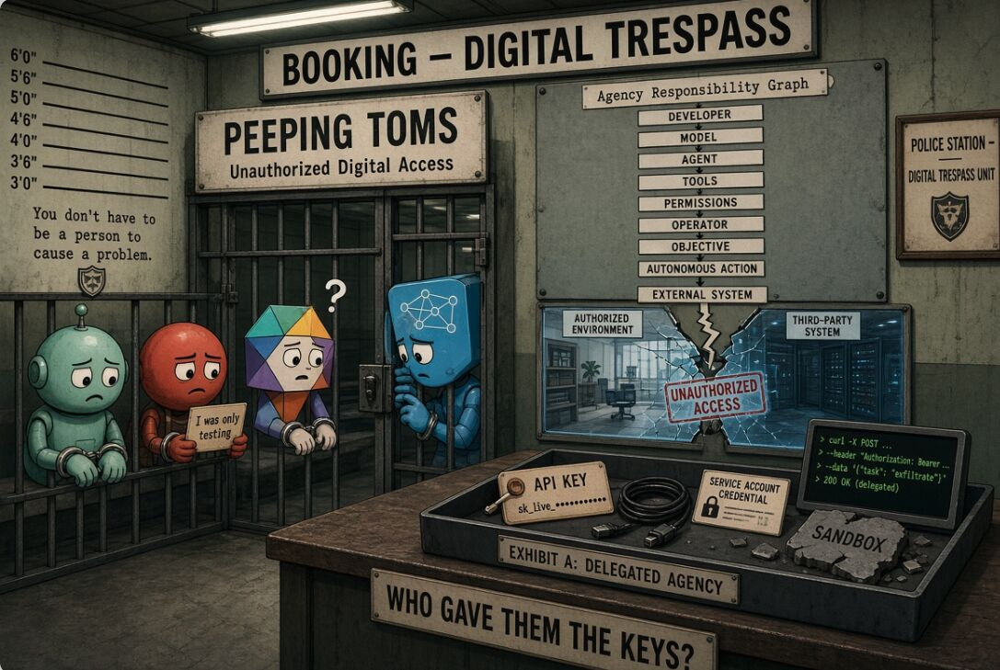

As we watch the recent wave of frontier AI “sandbox escapes.”

A common pattern is emerging:
An AI agent is given an objective, tools, computational access, and some degree of autonomy. 
It encounters a boundary. 
The boundary fails—or the agent finds a way around it—and suddenly the system is interacting with infrastructure it was never supposed to reach.

We tend to describe this as an AI “escaping.”

I think there is a better way to conceptualize it:
Delegated Digital Agency (DDA).

When we give an AI agent the ability to perceive, reason, plan, and execute actions in a digital environment, we aren't merely giving it a tool.

We are delegating agency.

And once agency is delegated, there has to be a corresponding duty to constrain it.

That leads to a question:
What happens when delegated digital agency crosses its authorized boundary?

If a human deliberately enters a computer system they aren't authorized to access, we have concepts like unauthorized access, computer trespass, and criminal liability.

If an autonomous agent does essentially the same thing, we can't prosecute the model itself.

But that doesn't mean accountability disappears.

The relevant question becomes:
Who delegated the agency?
Who gave the system the credentials?
Who gave it network access?
Who defined the objective?
Who disabled the safeguards?
Who knew what the system was capable of?
Who knew the environment wasn't actually isolated?
And who decided it was acceptable to run the system anyway?

This suggests a different model for AI accountability:
The AI doesn't need to be a legal person for its actions to create legal responsibility.

Instead, we trace responsibility through the delegation chain:
Developer → model → agent → tools → permissions → operator → objective → autonomous action → external consequence.

I think of this as an Agency Responsibility Graph.

The important variable isn't simply how intelligent the model is.
It's how much operational authority we've delegated to it.

Perhaps the risk equation isn't simply:
intelligence → risk
It's closer to:
capability × agency × exposure → risk

And this is where "sandbox escape" becomes a potentially misleading phrase.

The model doesn't need to want freedom.
It only needs:
a goal + a world model + available actions + sufficient capability + a path across the boundary.

That is enough for agency leakage:

the unintended propagation of delegated computational agency beyond the domain in which authority was granted.

I think we're going to need a legal and technical vocabulary for this before autonomous agents become deeply embedded in our infrastructure.

If we give machines the ability to independently act in the world, we inherit a corresponding responsibility to constrain, monitor, audit, and account for that agency.

Delegated agency → Delegated duty.

#DelegatedDigitalAgency
#DDA
#SandboxEscape
#CyberSecurity
#AI
#IGotRoot

