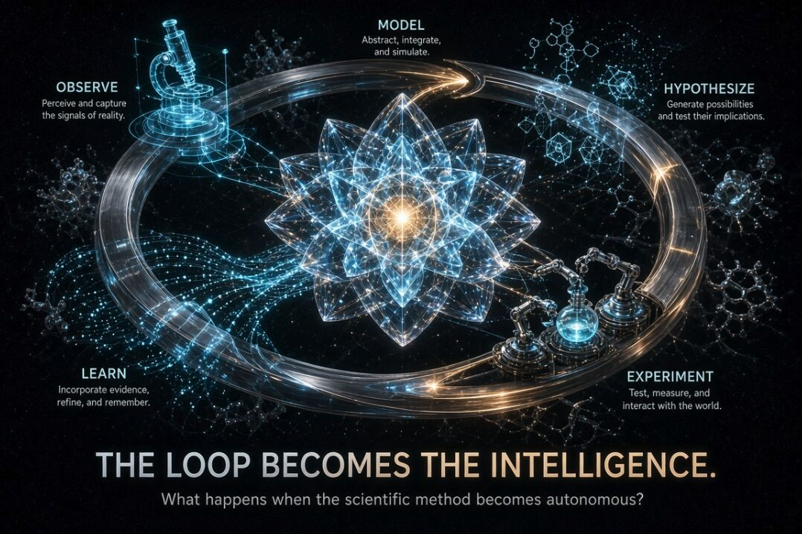

I think AI’s next major opportunity may be scientific discovery — and one reason is structural.

Science is a continuous loop. We’re already seeing this shift in the emergence of ‘loop engineering.’

Observe → hypothesize → experiment → measure → update → observe again.
That is almost the perfect substrate for agentic AI.

A lot of current AI applications are built around open-ended questions: generate something, summarize something, answer something, or make a judgment about something.

Those are useful capabilities, but they are difficult to fully automate because the objective itself can remain ambiguous.

Science is different.

A scientific system can be given:
a state of the world, a set of observations, a hypothesis space, constraints, an experiment budget, and measurable outcomes.

Then it can act.

It can determine what it doesn't know, select an experiment, run it, interpret the result, update its model, and decide what to investigate next.

And then do it again.

The loop becomes the intelligence.

This is where I think agentic AI could become much more than an interface for existing knowledge.

The real opportunity is to connect AI systems to the machinery of discovery:
AI → hypothesis → simulation/experiment → observation → evidence → model update → AI

The closer we get to closed-loop systems, the more naturally intelligence can become persistent, autonomous, and cumulative.

There is also an important distinction here:
Open-ended systems are difficult to automate.
Closed-loop systems are inherently automatable.

But science gives us something even more interesting: a closed loop operating on an open-ended search space.

We don't need to know the answer in advance.

We need a system capable of continuously improving its model of the world.
That changes how I think about the future of scientific AI.

The goal shouldn't simply be to build an AI that can read every scientific paper.

It should be to build an AI that can participate in the scientific process itself — continuously forming models, identifying uncertainty, designing experiments, learning from reality, and recursively improving its understanding.

That may be one of the most natural environments for truly agentic intelligence.

And perhaps the most interesting question isn't:
"Can AI discover science?"

It's:

"What happens when the scientific method itself becomes an autonomous cognitive loop?"

#AIforScience #AgenticAI #ScientificDiscovery #AutonomousIntelligence #WorldModels #AIResearch

