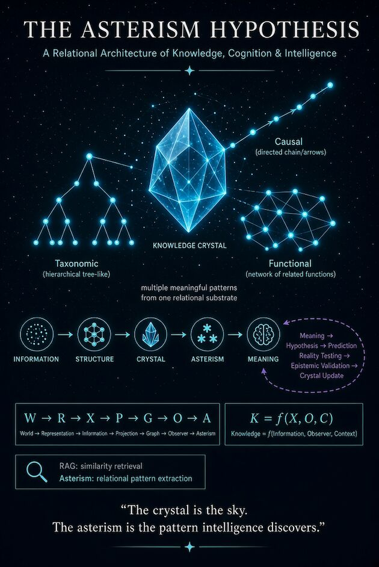

I've been thinking about a weird connection between cognition, crystals, microtubules, and asterism

The idea starts with something I've been coming back to:
Identity is observer-dependent

Something isn't necessarily defined only by what it is internally.
Its identity also depends on its relationships with everything around it

That got me thinking about cognition

Maybe cognition is, at a fundamental level, a form of recursive data compression — taking an enormous amount of information and continuously finding structures, relationships, and patterns that are useful enough to preserve

Then I started thinking about consciousness

During anesthesia, subjective experience can disappear even though much of the underlying biological machinery remains intact

One of the hypotheses in consciousness research involves microtubules and how anesthetics may interact with them

Microtubules are made from proteins arranged in highly ordered lattice structures
Basically…
a biological lattice

And that sent me down a rabbit hole
Because crystals are also highly ordered structures
And crystallography gives us a surprisingly constrained vocabulary for describing periodic structure — including the 14 Bravais lattices

So I started wondering:
What if a crystal is a useful physical isomorphism for thinking about knowledge?
Not that knowledge is literally a crystal
More that a crystal gives us a way to think about information becoming structure

And then I came across something that really stuck with me:
asterism in rose quartz

You can see what looks like a six-pointed star inside the crystal
But there isn't actually a little star trapped inside the quartz
The pattern emerges from the way light interacts with the microscopic structure of the crystal

Change the angle of the light, and the star moves
And that made me rethink what I meant by an asterism
Maybe the important part isn't simply that a pattern is discovered
Maybe the pattern emerges through an interaction between structure, signal, and observer
The structure is there
The light is there
But the visible pattern depends on how they interact

That feels strangely similar to cognition

A relational substrate contains many possible patterns
An observer interacts with that substrate and certain relationships become salient

Those relationships can then be connected, compressed into a meaningful structure, tested against reality, and used to update the underlying model

So I'm currently playing with this:
Information → Structure → Crystal → Asterism → Meaning

The knowledge crystal is the relational substrate
The asterism is the pattern that emerges from interacting with it
And the "astral" part is intentional too
I'm thinking about knowledge almost like a point cloud of information
The points are there
But intelligence isn't just retrieving individual points
It's finding relationships between them

#Cognition
#ArtificialIntelligence
#InformationTheory
#WorldModels
#Crystallography
#Asterism

