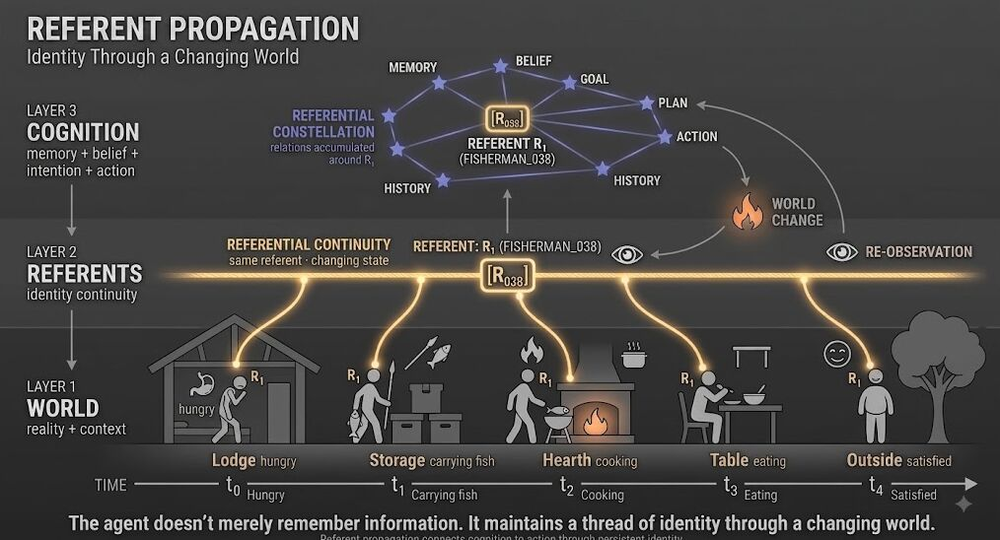

Referential Propagation

Let that roll off the tongue... or not... lol

I've been thinking more about loop engineering and I think one missing piece is referential propagation.

A loop isn't just:
observe → think → act → observe

The system also has to know that what it observes after acting relates to the same thing it was acting on before.

A persistent referent lets an agent carry identity through the loop:
observe → referent → memory/belief → intent → action → world change → re-observe → same referent

That creates continuity between cognition and consequence.

Without it, you can build increasingly sophisticated loops that are still essentially disconnected episodes.

With it, the loop starts to become a trajectory through a world.

And maybe that's closer to what we actually mean by agency: not just the ability to act, but the ability to remain oriented toward something as it changes.

#IGotRooT
#ReferentialPropagation
#LoopEngineering
#AIAgents
#WorldModels
#AgenticAI
#ArtificialIntelligence

