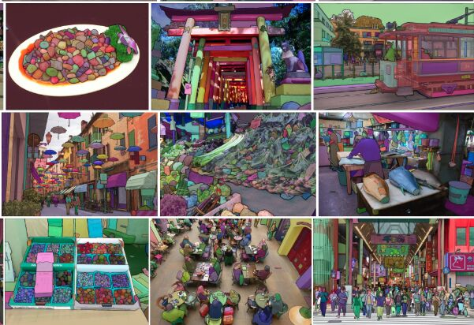

Google vs. Facebook.

SynthID vs. SAM.

Provenance vs. Laundry. 🧺

Disclaimer: SAM in this context is Meta/Facebook’s Segment Anything Model(s), not Sam Altman.

From my reading, Google’s SynthID is remarkably resilient.

It embeds a pixel-level signal that can survive repeated rounds of image filtering and mutation. The weak point seems to be scale — cropping and aggressively reducing the image’s context can remove the watermark. 

But that sucks.

You’re sacrificing image quality and context just to prove provenance. 

Then I heard about Claude introducing a similar kind of mechanism for text, and it got me thinking about chunking.

If text can be broken into independently analyzable pieces, why not think about images the same way?

And for images, there isn’t much better chunking/extraction technology than Meta’s Segment Anything Model — SAM.

Instead of treating an image as one indivisible artifact, you can treat it as a collection of visual objects.

Image → Segment → Analyze → Reconstruct.

People have an unfortunate distaste for content labeled AI generated.

Posting something with an AI-generated label is almost like seeing expired milk at the grocery store.

You look right past it.

Maybe you get slightly annoyed that it’s still sitting there blocking the good product.

So here’s the weird future we’re walking toward:

Google is building increasingly resilient provenance.

Meta is building increasingly powerful visual decomposition.

One says:

I know this image was generated.

The other says:

I can tell you what is actually in this image.

And somewhere in the middle is a new kind of adversarial pipeline:

detect → segment → transform → reconstruct → detect again.

Don’t label your material as spoiled.

Let SAM do the laundry. 

Get rid of those pesky bugs. 

I’m going SAM with a knockout on this one.

Facebook has been crushing the computer vision scene.

*photo from kaggle*

#ArtificialIntelligence
#ComputerVision
#SynthID
#SAM
#GenerativeAI
#MachineLearning
#AI

