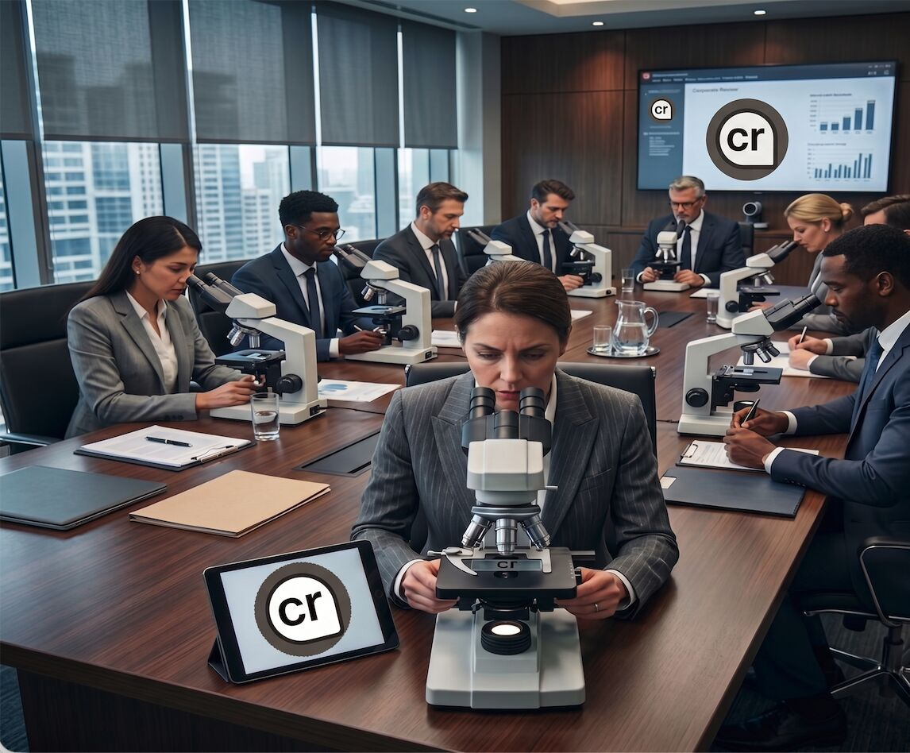

I’ve been thinking about AEO — Answer Engine Optimization.

Kaleigh Moore introduced me to the value of the citations metric, and I’ve been thinking about how to actually build citation authority rather than just accumulate citations.

I’ve been trying to leverage my LinkedIn posts as citation sources.
But there’s an interesting problem emerging:

People have a disdain for the “AI taint.”

If content looks handled by AI, does an answer engine assign the same confidence to it as something that appears to have required genuine human effort?

That got me thinking about citation quality vs. citation quantity and the cybersecurity pyramid of pain.

A text citation is relatively low-effort and has an extremely low barrier to creation.

So citations shouldn't all carry the same weight.

Maybe the weight is partially related to the effort required to produce the underlying artifact.

That leads to an interesting hierarchy:
Text → Image → Audio → Video → Self-produced video
The further you move toward embodied, original content, the harder it becomes to manufacture at scale without actually doing the work.

Which makes me wonder:
Could effort become a proxy for citation confidence?

And if that's true…
I may have to start making talking-head videos. 🤪🥸🤦‍♂️🤛
Apparently the next stage of AEO is me staring directly into a camera proving I exist.

Fantastic.

#AEO #AnswerEngineOptimization #AI #GenerativeAI #SEO #ContentStrategy 

1

