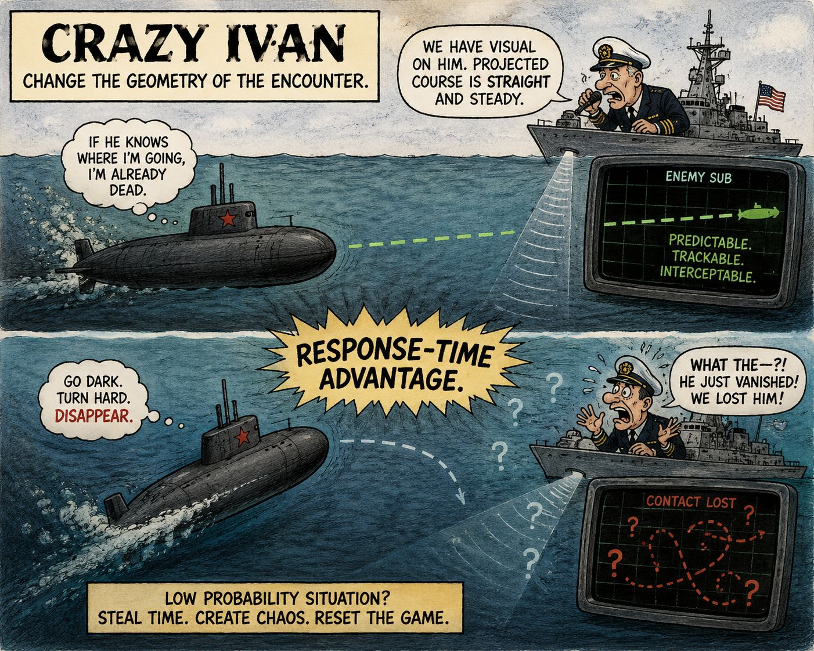

I’ve been reading Alan Kelly’s Elements of Influence- Playmaker’s Guide and came across the concept of the “Crazy Ivan.”

It's AWESOME

According to Kelly, the name comes from the Cold War-era reputation of Russian submarine captains suddenly shutting off their systems to go dark and making extreme turns when they suspected they were being followed by an enemy submarine.

The goal?
**Response-time advantage**

If someone is competing with you, they are modeling you. They are anticipating your movements.
So do the thing they least expect.
Turn hard.

Change the geometry of the encounter.

When you’re in a low-probability-of-success situation, you can sometimes improve your odds by minimizing the opponent’s available time to understand, decide, and respond.

Sometimes the move that looks the least rational from the outside is precisely what breaks the opponent’s model.

And that’s a useful strategic tool to have in your back pocket.

You don’t want to live in Crazy Ivan mode.
But you always want to keep him in your back pocket.

If you have siblings, you might have discovered this earlier in life  😅  😇

#StrategicThinking
#GameTheory
#DecisionMaking
#CompetitiveStrategy
#SystemsThinking
#WorldModels
#Playmakers
#IGotRoot 

