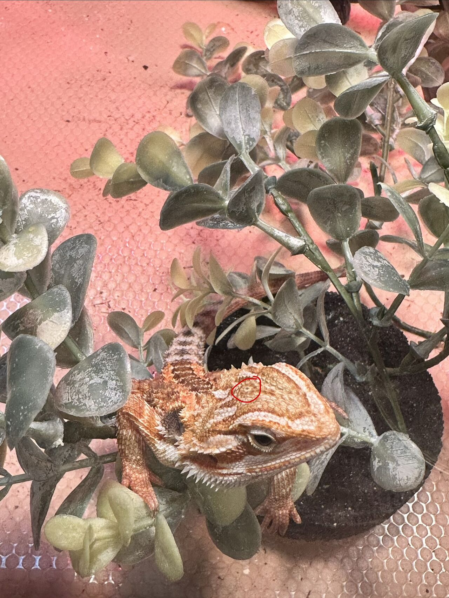

I recently discovered that Godzilla, our family Bearded Dragon, has three eyes.

Not one.
Not two.
THREE.

Apparently Godzilla has a tiny third eye on top of his head called a parietal eye.

So, naturally, I had to ask:

WTH is that for?

It's like a little skylight that helps him sense changes in light.

It's another one of those things that makes me love biology.

We tend to think of animals as having a familiar set of human senses:
sight.
hearing.
smell.
touch.

But evolution isn't that simple.

The animal kingdom is full of these weird little sensory hacks, overlapping signals, and evolutionary leftovers that let animals gather information about the world in ways we don't immediately recognize.

That got me thinking...
What does the world look like to an observer with a completely different sensory system?

Godzilla isn't just seeing our world differently.

His sensory architecture determines what information he can detect, what becomes meaningful, and ultimately how the world is represented to him.

Different observers. 
Different sensory schematics.
Different representations of the same world.

We experience one world.

Godzilla experiences another.

#Biology
#Evolution
#AnimalBehavior
#ComparativeBiology
#SensorFusion
#IGotRoot
#SystemsThinking
#Godzilla
