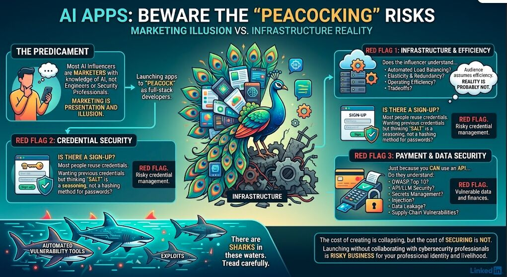

Here’s the thing about AI influencers...
Most of them are marketers with knowledge of AI.
And I respect that.

So what’s the harm?

Marketing is presentation. It’s an illusion. And it doesn’t have a whole lot to do with Infrastructure as Code (IaC).

The problem is when these influencers launch web applications and suddenly it presents as if they understand IaC.

The audience assumes it runs efficiently and optimally.

But are they actually using cloud infrastructure and understanding automated load balancing, elasticity, redundancy, and the associated tradeoffs?

Probably not.

So do they actually understand operating efficiency?

Red flag.

Is there a sign-up mechanism?

Most people reuse credentials.

You want my previously used credentials...

but you think salt is a seasoning rather than a method for secure password hashing?

Red flag.

Is there a payment mechanism?

Just because you CAN use an API doesn’t mean you understand the implications of doing so.

Do you understand the OWASP Top 10?
API security?
LLM security?
Secrets management?
Injection?
Data leakage?
Supply-chain vulnerabilities?
Didn't think so.
Red flag.

It’s really easy to “peacock” and present as a full-stack developer right now.
But it’s even easier for cybersecurity tools to automate vulnerability detection and exploitation.

So tread carefully.

There are sharks in these waters.

The cost of producing a convincing application is collapsing.

But the cost of securing one is not.

And if you’re willing to put a product into production, attach your professional identity and livelihood to it, and not even collaborate with a cybersecurity professional...

that’s risky business.

#ArtificialIntelligence
#AILiteracy
#Cybersecurity
#ApplicationSecurity
#OWASP
#InfrastructureAsCode
#ResponsibleAI
#DevSecOps
#IGotRoot

