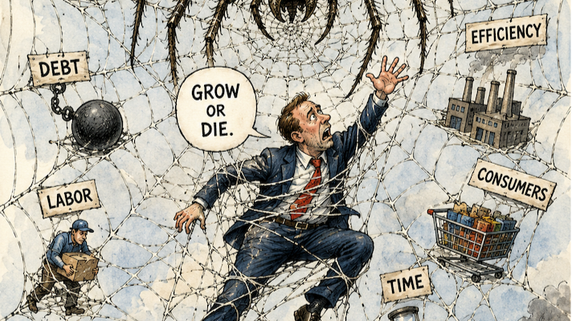

Something I keep coming back to...

**Nothing likes being stuck.**

**Consider a spider web.**

At its root, it's a matter of **adherence**.

The prey isn't necessarily defeated by the spider itself. It becomes adhered to the surface of the web, almost like glue. Its momentum gets converted into resistance. Movement becomes deformation. Deformation becomes attachment.

**In other words... adherence is constraint.**

And I think this is a much more universal phenomenon than we give it credit for.

A system under constraint naturally wants to find a way out of that constraint.

System settles toward a lower-energy configuration.

Things slide downhill.

A system moves along the topology available to it, following paths that require less strain, less friction, less resistance.

The system doesn't necessarily need to “want” anything.

**The dynamics are enough.**

And I think models do something remarkably similar.

A model is constantly moving through a space of possible states: representations, interpretations, predictions, beliefs, actions, hypotheses.

There is a kind of **drift and slip** that happens.

Given enough freedom, a model will tend to move toward states that are easier to occupy.

States with less internal tension.

Less contradiction.

Less friction.

Less transition cost.

A lower-cost basin.

A lower-tension state.

You could almost imagine pouring a liquid over the topology of a model's state space.

It doesn't need to be told where to go.

**The landscape tells it.**

That doesn't mean the lowest-friction state is the most correct state.

That's the important part.

A model can arrive somewhere because it is true.

Or because it is stable.

Or because it is familiar.

Or because it is statistically easy to continue from where it already is.

Those are not the same thing.

And this is where I think **model drift** becomes so interesting.

The model doesn't have to consciously decide to become wrong.

It can simply keep slipping.

A little bit at a time.

Toward the state of lower tension.

Toward the state with less resistance.

Toward the explanation that requires less work.

Toward the representation that is easier to maintain.

Until eventually the accumulated drift becomes the new posture of the system.

### Capitalism is an interesting human example

This is also why I keep thinking about competitive capitalism as a human-scale example of the same phenomenon.

Capitalism gives us an extremely effective mechanism for trying to escape adhesion.

**Grow or die.**

You are constrained by scarcity, competitors, labor, debt, geography, resources, technology, markets.

So you grow.

You acquire more capital.

More capability.

More territory.

More efficiency.

More leverage.

More customers.

More infrastructure.

You are constantly trying to increase your degrees of freedom so that the web can't catch you.

But here is the uncomfortable part:

**We're not eliminating the web.**

We're outrunning it.

We are constantly trying to move faster than the constraints being created around us.

Your competitor is growing.

So you grow.

They become more efficient.

So you become more efficient.

They acquire resources.

So you acquire resources.

They scale.

So you scale.

It starts to look almost adversarial.

A little like a **generative adversarial network**.

One system adapts.

The other adapts to that adaptation.

Then the first adapts again.

Neither is necessarily solving the underlying problem.

They are continuously trying to generate a state in which the other system cannot constrain them.

**Competition becomes an escape mechanism from adhesion.**

And it works.

For a while.

### But growth can be a delayed constraint

That's where I think the deeper problem appears.

Growth can increase your freedom in the short term while increasing your constraints in the long term.

You escape one constraint and create five more.

You gain scale.

Now you have more dependencies.

You have more infrastructure.

More employees.

More capital requirements.

More energy requirements.

More supply chains.

More coordination.

More things that can break.

You didn't destroy the web.

**You built a bigger web around yourself.**

And now you have to keep growing to avoid getting caught by it.

That is what I mean by **delayed constraints**.

We aren't necessarily solving adhesion.

We are pushing the boundary at which adhesion becomes unavoidable.

We are moving the constraint outward.

And because everyone else is doing the same thing, the whole system is incentivized to keep moving.

**Grow or die becomes outrun or be outrun.**

### But you cannot outrun topology forever

Eventually, unchecked drift starts to have another consequence.

You lose posture.

You lose stability.

You become increasingly optimized for movement rather than maintaining structural integrity.

And this is where I think the analogy becomes particularly interesting for intelligent systems.

A model that continually slips toward lower friction can become extremely good at **continuation** while becoming progressively worse at **resistance**.

It stops asking:

> Is this actually correct?

And starts asking:

> What state can I reach from here with the least resistance?

That is a very different optimization.

The same thing can happen to organizations.

The same thing can happen to economies.

The same thing can happen to models.

A system can become extraordinarily optimized for the local landscape while losing its ability to maintain a stable posture against the environment.

It is adapting faster and faster.

But its center of gravity is disappearing.

### This is where “model collapse” becomes interesting

I'm not using model collapse here merely in the narrow machine-learning sense.

I'm thinking about **systemic collapse from accumulated drift**.

If every generation of a system is optimized against the state produced by the previous generation, you can eventually begin optimizing against your own artifacts.

The model learns from the model.

The market responds to the market.

The organization responds to the incentives it created.

The next system is trained on the outputs of the previous system.

And the feedback loop becomes increasingly self-referential.

The original environment starts disappearing from the training signal.

You get:

**drift → adaptation → reinforcement → further drift.**

Eventually the system can become exquisitely optimized for its own generated topology while becoming increasingly disconnected from the topology that actually matters.

That's when stability starts to deteriorate.

### Maybe the enemy isn't friction

This brings me back to the spider web.

The web isn't evil because it has tension.

The tension is what gives the web structure.

The problem is getting caught in it.

And perhaps the same is true for intelligent systems.

We don't actually want zero friction.

We need resistance.

Resistance is what tells us that something has changed.

Contradiction creates a signal.

Failure creates a signal.

Uncertainty creates a signal.

A force pushing back against the system is information.

The goal isn't to eliminate all resistance.

The goal is to remain capable of **responding to resistance without becoming adhered to it.**

That may be the deeper distinction between adaptation and drift.

Between intelligence and optimization.

Between growth and sustainability.

Between movement and escape.

**Nothing likes being stuck.**

But constantly trying to escape the web has its own failure mode.

At some point, you can spend so much energy trying to outrun the constraint that you lose the stability required to remain a coherent system.

Maybe that's the balance we're actually searching for:

**Enough tension to maintain structure.** **Enough freedom to move.** **Enough friction to detect the environment.** **Enough plasticity to change.** **Enough posture to keep from falling apart.**

Because the ultimate failure may not be getting caught in the web.

**It may be drifting so far from stability that you can no longer tell you're falling.**

#ArtificialIntelligence #MachineLearning #SystemsThinking #AIAlignment #CognitiveScience #EmergentBehavior #ModelCollapse #Optimization #SystemsTheory
