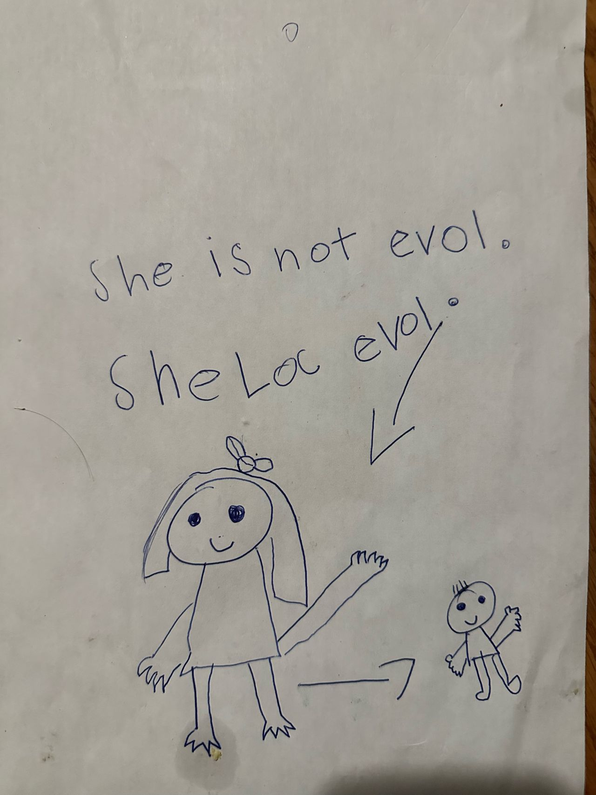

Proud parent moment.

I was cleaning up the art supplies at 1am and stumbled across this drawing.

Looks like a self-depiction of my six-year-old daughter and her three-year-old brother.

Apparently, she’s not evil. But she does, however, love her evil little brother? 😂

She had me at the flow chart. That’s my girl!

Dude can be a little shi** sometimes, but he isn’t evil. We’ll work on the terminology. I’m just glad she loves him anyway. 

Patting myself on the back for cleaning up the art supplies at 1am.

Worth it.

#ProudParent
#Parenting
#Siblings
#FutureEngineer
#SystemsThinking

2

