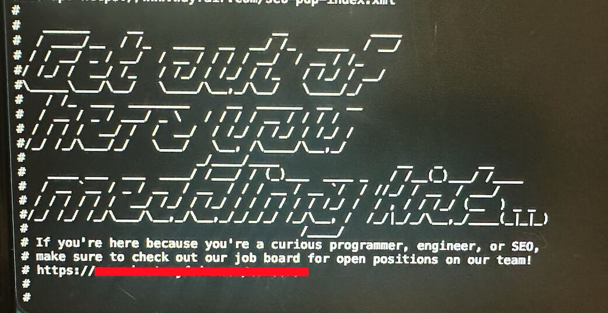

Remember back in the early 2000s...
There was that weird guy.
Criss Angel.
MindFreak.

I mean... it was kinda cool.
And apparently it stuck with me because I just got MindFreaked by a robots.txt. 😂

A little Easter egg sitting at the bottom...

Essentially:
Get out of here, you rascals.
Unless you're looking for a job.
In which case...
Here's the door.

Not the publicized career portal.
The speakeasy access
In the form of an affiliate link.

A URL that ultimately routes you to the same career portal everyone else can find but you come with extra cookies in your pockets.

The résumé refiners forgot to mention something important.

Finding the right door.

It doesn't matter how perfectly optimized your résumé is if you're knocking on the wrong one.

Sometimes the interesting doors aren't advertised.
They're sitting in plain sight in the infrastructure.
robots.txt
llms.txt
Documentation.
Sitemaps.
APIs.

Little breadcrumbs that tell you how an organization actually structures and exposes information.

Companies leave a surprising amount of surface treasure sitting in their AI-relevant text files.

The trick is putting in the effort and knowing where to look.

So if you're hunting for a job:
Mix it up and focus less on polishing the résumé and more on finding the treasure.
And pay attention to your data cookies. 🍪

If you're not job hunting--
Know your adversaries.

Always be hunting.

#JobHunting
#AI
#MINDFREAK
#TreasureMaps
#OSINT
#Infosec
#Hunting
#AgentTextFiles
#IGotRoot
